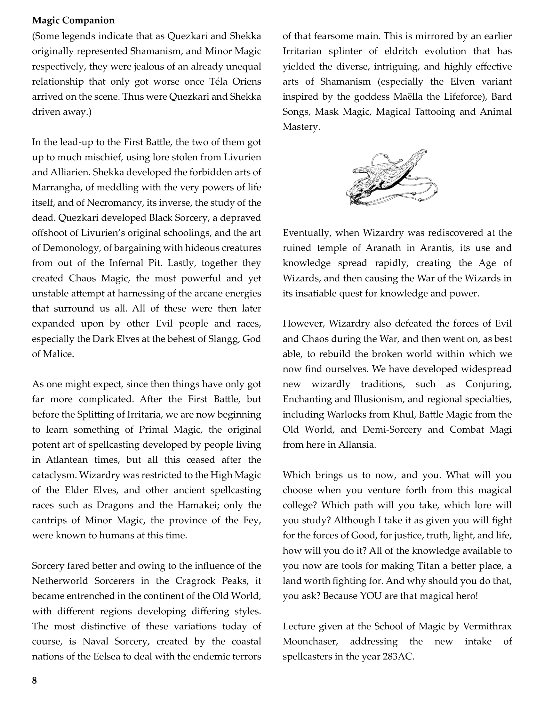
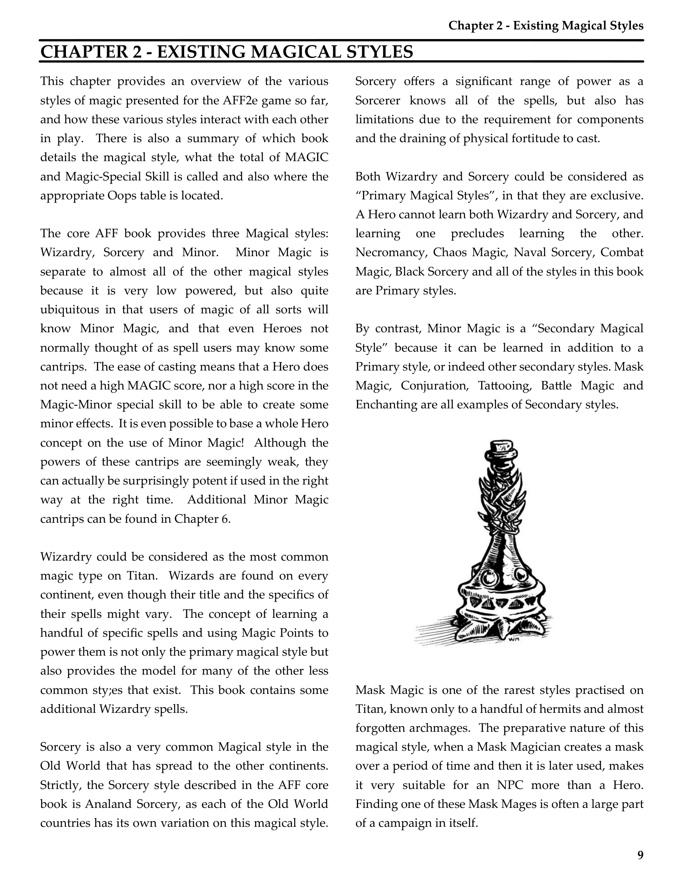
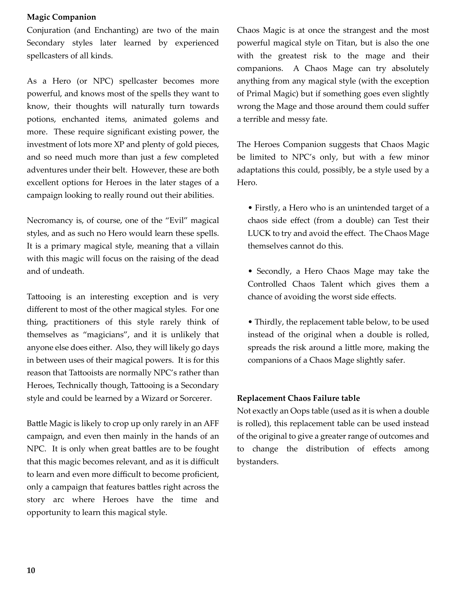
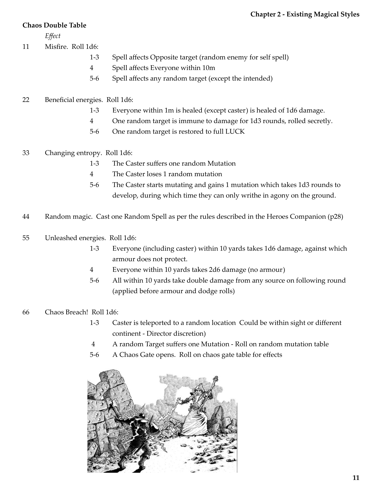

# Existing Magical Styles

**Source:** CB77028 - Magic Companion  
**Pages:** 9-12

Chapter 2: Existing Magical Styles

---

## Chapter 2 - Existing Magical Styles

This chapter provides an overview of the various styles of magic presented for the AFF2e game so far, and how these various styles interact with each other in play. There is also a summary of which book details the magical style, what the total of MAGIC and Magic-Special Skill is called and also where the appropriate Oops table is located.

The core AFF book provides three Magical styles: Wizardry, Sorcery and Minor. Minor Magic is separate to almost all of the other magical styles because it is very low powered, but also quite ubiquitous in that users of magic of all sorts will know Minor Magic, and that even Heroes not normally thought of as spell users may know some cantrips. The ease of casting means that a Hero does not need a high MAGIC score, nor a high score in the Magic-Minor special skill to be able to create some minor effects. It is even possible to base a whole Hero concept on the use of Minor Magic! Although the powers of these cantrips are seemingly weak, they can actually be surprisingly potent if used in the right way at the right time. Additional Minor Magic cantrips can be found in Chapter 6.

Wizardry could be considered as the most common magic type on Titan. Wizards are found on every continent, even though their title and the specifics of their spells might vary. The concept of learning a handful of specific spells and using Magic Points to power them is not only the primary magical style but also provides the model for many of the other less common styles that exist. This book contains some additional Wizardry spells.

Sorcery is also a very common Magical style in the Old World that has spread to the other continents. Strictly, the Sorcery style described in the AFF core book is Analand Sorcery, as each of the Old World countries has its own variation on this magical style. Sorcery offers a significant range of power as a Sorcerer knows all of the spells, but also has limitations due to the requirement for components and the draining of physical fortitude to cast.

Both Wizardry and Sorcery could be considered as "Primary Magical Styles", in that they are exclusive. A Hero cannot learn both Wizardry and Sorcery, and learning one precludes learning the other.

Necromancy, Chaos Magic, Naval Sorcery, Combat Magic, Black Sorcery and all of the styles in this book are Primary styles.

By contrast, Minor Magic is a "Secondary Magical Style" because it can be learned in addition to a Primary style, or indeed other secondary styles. Mask Magic, Conjuration, Tattooing, Battle Magic and Enchanting are all examples of Secondary styles.

### Mask Magic

Mask Magic is one of the rarest styles practised on Titan, known only to a handful of hermits and almost forgotten archmages. The preparative nature of this magical style, when a Mask Magician creates a mask over a period of time and then it is later used, makes it very suitable for an NPC more than a Hero. Finding one of these Mask Mages is often a large part of a campaign in itself.

### Conjuration and Enchanting

Conjuration (and Enchanting) are two of the main Secondary styles later learned by experienced spellcasters of all kinds.

As a Hero (or NPC) spellcaster becomes more powerful, and knows most of the spells they want to know, their thoughts will naturally turn towards potions, enchanted items, animated golems and more. These require significant existing power, the investment of lots more XP and plenty of gold pieces, and so need much more than just a few completed adventures under their belt. However, these are both excellent options for Heroes in the later stages of a campaign looking to really round out their abilities.

### Necromancy

Necromancy is, of course, one of the "Evil" magical styles, and as such no Hero would learn these spells. It is a primary magical style, meaning that a villain with this magic will focus on the raising of the dead and of undeath.

### Tattooing

Tattooing is an interesting exception and is very different to most of the other magical styles. For one thing, practitioners of this style rarely think of themselves as "magicians", and it is unlikely that anyone else does either. Also, they will likely go days in between uses of their magical powers. It is for this reason that Tattooists are normally NPC's rather than Heroes. Technically though, Tattooing is a Secondary style and could be learned by a Wizard or Sorcerer.

### Battle Magic

Battle Magic is likely to crop up only rarely in an AFF campaign, and even then mainly in the hands of an NPC. It is only when great battles are to be fought that this magic becomes relevant, and as it is difficult to learn and even more difficult to become proficient, only a campaign that features battles right across the story arc where Heroes have the time and opportunity to learn this magical style.

### Chaos Magic

Chaos Magic is at once the strangest and the most powerful magical style on Titan, but is also the one with the greatest risk to the mage and their companions. A Chaos Mage can try absolutely anything from any magical style (with the exception of Primal Magic) but if something goes even slightly wrong the Mage and those around them could suffer a terrible and messy fate.

The Heroes Companion suggests that Chaos Magic be limited to NPC's only, but with a few minor adaptations this could, possibly, be a style used by a Hero.

- Firstly, a Hero who is an unintended target of a chaos side effect (from a double) can Test their LUCK to try and avoid the effect. The Chaos Mage themselves cannot do this.

- Secondly, a Hero Chaos Mage may take the Controlled Chaos Talent which gives them a chance of avoiding the worst side effects.

- Thirdly, the replacement table below, to be used instead of the original when a double is rolled, spreads the risk around a little more, making the companions of a Chaos Mage slightly safer.

### Replacement Chaos Failure Table

Not exactly an Oops table (used as it is when a double is rolled), this replacement table can be used instead of the original to give a greater range of outcomes and to change the distribution of effects among bystanders.

#### Chaos Double Table

| Roll | Effect |
|------|--------|
| **11 Misfire.** Roll 1d6: | 1-3 Spell affects Opposite target (random enemy for self spell) 4 Spell affects Everyone within 10m 5-6 Spell affects any random target (except the intended) |
| **22 Beneficial energies.** Roll 1d6: | 1-3 Everyone within 1m is healed (except caster) is healed of 1d6 damage. 4 One random target is immune to damage for 1d3 rounds, rolled secretly. 5-6 One random target is restored to full LUCK |
| **33 Changing entropy.** Roll 1d6: | 1-3 The Caster suffers one random Mutation 4 The Caster loses 1 random mutation 5-6 The Caster starts mutating and gains 1 mutation which takes 1d3 rounds to develop, during which time they can only writhe in agony on the ground. |
| **44 Random magic.** | Cast one Random Spell as per the rules described in the Heroes Companion (p28) |
| **55 Unleashed energies.** Roll 1d6: | 1-3 Everyone (including caster) within 10 yards takes 1d6 damage, against which armour does not protect. 4 Everyone within 10 yards takes 2d6 damage (no armour) 5-6 All within 10 yards take double damage from any source on following round (applied before armour and dodge rolls) |
| **66 Chaos Breach!** Roll 1d6: | 1-3 Caster is teleported to a random location (Could be within sight or different continent - Director discretion) 4 A random Target suffers one Mutation - Roll on random mutation table 5-6 A Chaos Gate opens. Roll on chaos gate table for effects |

---

## Page Images

