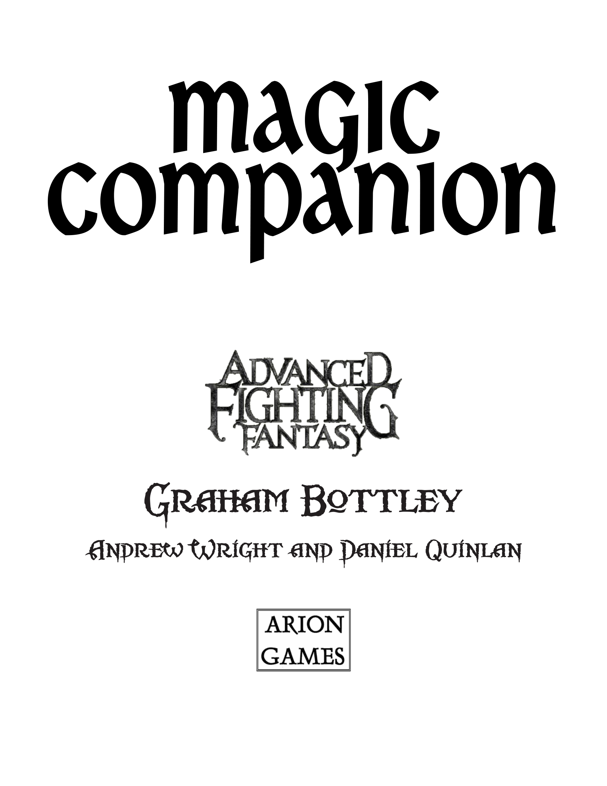
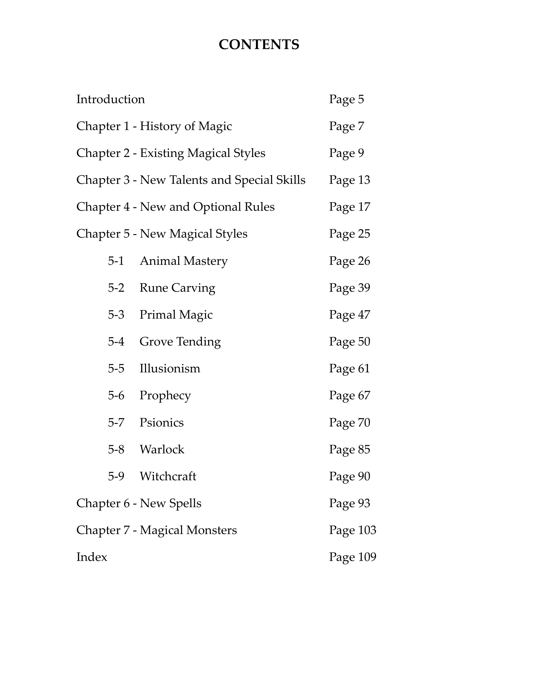
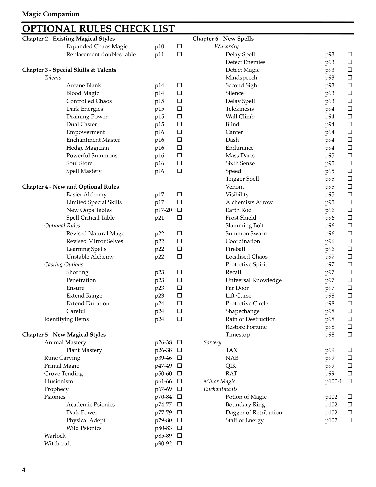
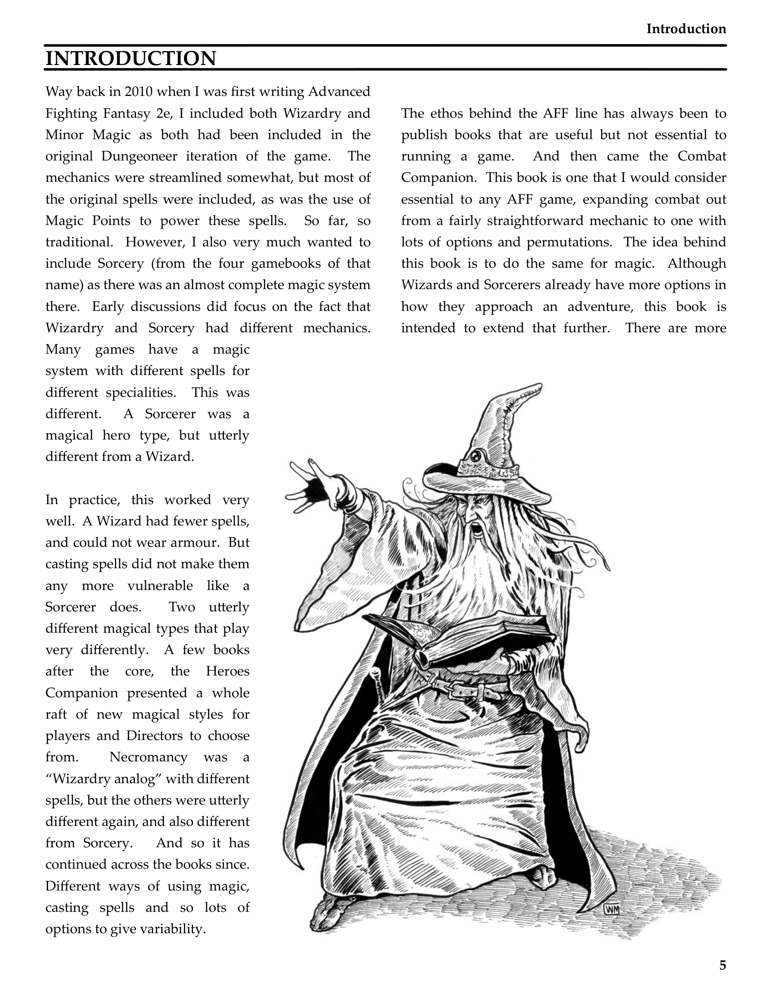

# Front Cover And Contents

**Source:** CB77028 - Magic Companion  
**Pages:** 1-6

Front cover, title page, and table of contents

---

## Contents

**Introduction** Page 5

**Chapter 1 - History of Magic** Page 7

**Chapter 2 - Existing Magical Styles** Page 9

**Chapter 3 - New Talents and Special Skills** Page 13

**Chapter 4 - New and Optional Rules** Page 17

**Chapter 5 - New Magical Styles** Page 25
- 5-1 Animal Mastery Page 26
- 5-2 Rune Carving Page 39
- 5-3 Primal Magic Page 47
- 5-4 Grove Tending Page 50
- 5-5 Illusionism Page 61
- 5-6 Prophecy Page 67
- 5-7 Psionics Page 70
- 5-8 Warlock Page 85
- 5-9 Witchcraft Page 90

**Chapter 6 - New Spells** Page 93

**Chapter 7 - Magical Monsters** Page 103

**Index** Page 113

---

## Introduction

Way back in 2010 when I was first writing Advanced Fighting Fantasy 2e, I included both Wizardry and Minor Magic as both had been included in the original Dungeoneer iteration of the game. The mechanics were streamlined somewhat, but most of the original spells were included, as was the use of Magic Points to power these spells. So far, so traditional. However, I also very much wanted to include Sorcery (from the four gamebooks of that name) as there was an almost complete magic system there. Early discussions did focus on the fact that Wizardry and Sorcery had different mechanics.

Many games have a magic system with different spells for different specialities. This was different. A Sorcerer was a magical hero type, but utterly different from a Wizard.

In practice, this worked very well. A Wizard had fewer spells, and could not wear armour. But casting spells did not make them any more vulnerable like a Sorcerer does. Two utterly different magical types that play very differently. A few books after the core, the Heroes Companion presented a whole raft of new magical styles for players and Directors to choose from. Necromancy was a "Wizardry analog" with different spells, but the others were utterly different again, and also different from Sorcery. And so it has continued across the books since. Different ways of using magic, casting spells and so lots of options to give variability.

The ethos behind the AFF line has always been to publish books that are useful but not essential to running a game. And then came the Combat Companion. This book is one that I would consider essential to any AFF game, expanding combat out from a fairly straightforward mechanic to one with lots of options and permutations. The idea behind this book is to do the same for magic. Although Wizards and Sorcerers already have more options in how they approach an adventure, this book is intended to extend that further. There are more magical styles so that a Hero need not only consider Wizardry or Sorcery for a spell using Hero, and many of these styles have a completely different mechanic. There are new options and new rules for spellcasters of any types and a raft of new spells for the original three styles.

This book has a lot of different options, and it is important to remember one thing. Not every option will fit into every new campaign. Don't feel pressured to include everything, especially if you are new to being a Director! Using all of the options in here is feasible, but it changes the dynamic of party and of the campaign itself, and it can be a challenge.

It is also important for the Director to carefully consider the access that Heroes have to the new spells in this book. Primal magic, for example, has the potential to be very powerful indeed, but the only way to learn any of the specific spells is to find an ancient tome or scroll that details the spell. If they do not find the spell written down, they cannot learn it. And so if a Director does not want a specific spell in their campaign, they should never allow the Heroes to find that spell. Do not allow the players to bully you into giving them access to a spell you don't want to be there!

This book also includes the concept of Primary and Secondary magical styles. A Primary style is one such as Wizardry or Sorcery. A Hero who knows one of these styles cannot ever learn another Primary style. The Secondary styles, such as Minor Magic and Enchanting, can be learned on their own, or in addition to a Primary style, and there is no limit in how many Secondary styles a Hero can learn, although they will likely need an awful lot of XP and even more gold pieces!

Lastly, this book also contains various tools and packages to assist the Director with magic-using enemies, and indeed to help when the Heroes themselves use magic against enemies. Like the enemy templates in the Combat Companion, these can be used as they are or modified as required.

---

## Page Images

