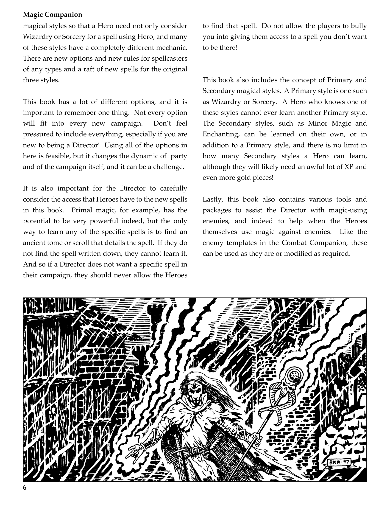
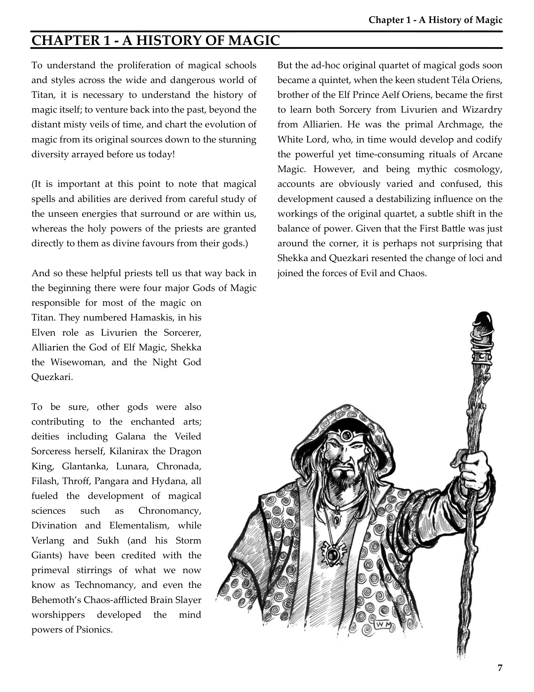

# History Of Magic

**Source:** CB77028 - Magic Companion  
**Pages:** 7-8

Chapter 1: A History of Magic

---

## Chapter 1 - A History Of Magic

To understand the proliferation of magical schools and styles across the wide and dangerous world of Titan, it is necessary to understand the history of magic itself; to venture back into the past, beyond the distant misty veils of time, and chart the evolution of magic from its original sources down to the stunning diversity arrayed before us today!

(It is important at this point to note that magical spells and abilities are derived from careful study of the unseen energies that surround or are within us, whereas the holy powers of the priests are granted directly to them as divine favours from their gods.)

And so these helpful priests tell us that way back in the beginning there were four major Gods of Magic responsible for most of the magic on Titan. They numbered Hamaskis, in his Elven role as Livurien the Sorcerer, Aliarien the God of Elf Magic, Sheka the Wisewoman, and the Night God Quezkari.

To be sure, other gods were also contributing to the enchanted arts; deities including Galana the Veiled Sorceress herself, Kilanirax the Dragon King, Glantanka, Lunara, Chronada, Filash, Throf, Pangara and Hydana, all fueled the development of magical sciences such as Chronomancy, Divination and Elementalism, while Verlang and Sukh (and his Storm Giants) have been credited with the primeval stirrings of what we now know as Technomancy, and even the Behemoth's Chaos-afflicted Brain Slayer worshipers developed the mind powers of Psionics.

But the ad-hoc original quartet of magical gods soon became a quintet, when the keen student Téla Oriens, brother of the Elf Prince Aelf Oriens, became the first to learn both Sorcery from Livurien and Wizardry from Aliarien. He was the primal Archmage, the White Lord, who, in time would develop and codify the powerful yet time-consuming rituals of Arcane Magic. However, and being mythic cosmology, accounts are obviously varied and confused, this development caused a destabilizing influence on the workings of the original quartet, a subtle shift in the balance of power. Given that the First Battle was just around the corner, it is perhaps not surprising that Sheka and Quezkari resented the change of loci and joined the forces of Evil and Chaos.

(Some legends indicate that as Quezkari and Sheka originally represented Shamanism, and Minor Magic respectively, they were jealous of an already unequal relationship that only got worse once Téla Oriens arrived on the scene. Thus were Quezkari and Sheka driven away.)

In the lead-up to the First Battle, the two of them got up to much mischief, using lore stolen from Livurien and Aliarien. Sheka developed the forbidden arts of Marangha, of meddling with the very powers of life itself, and of Necromancy, its inverse, the study of the dead. Quezkari developed Black Sorcery, a depraved offshoot of Livurien's original schoolings, and the art of Demonology, of bargaining with hideous creatures from out of the Infernal Pit. Lastly, together they created Chaos Magic, the most powerful and yet unstable attempt at harnessing of the arcane energies that surround us all. All of these were then later expanded upon by other Evil people and races, especially the Dark Elves at the behest of Slang, God of Malice.

As one might expect, since then things have only got far more complicated. After the First Battle, but before the Splitting of Iritaria, we are now beginning to learn something of Primal Magic, the original potent art of spellcasting developed by people living in Atlantean times, but all this ceased after the cataclysm. Wizardry was restricted to the High Magic of the Elder Elves, and other ancient spellcasting races such as Dragons and the Hamakei; only the cantrips of Minor Magic, the province of the Fey, were known to humans at this time.

Sorcery fared better and owing to the influence of the Netherworld Sorcerers in the Cragrock Peaks, it became entrenched in the continent of the Old World, with different regions developing differing styles. The most distinctive of these variations today of course, is Naval Sorcery, created by the coastal nations of the Eelsea to deal with the endemic terrors of that fearsome main. This is mirrored by an earlier Iritarian splinter of eldritch evolution that has yielded the diverse, intriguing, and highly effective arts of Shamanism (especially the Elven variant inspired by the goddess Maëla the Lifeforce), Bard Songs, Mask Magic, Magical Tattooing and Animal Mastery.

Eventually, when Wizardry was rediscovered at the ruined temple of Aranath in Arantis, its use and knowledge spread rapidly, creating the Age of Wizards, and then causing the War of the Wizards in its insatiable quest for knowledge and power.

However, Wizardry also defeated the forces of Evil and Chaos during the War, and then went on, as best able, to rebuild the broken world within which we now find ourselves. We have developed widespread new wizardly traditions, such as Conjuring, Enchanting and Illusionism, and regional specialties, including Warlocks from Khul, Battle Magic from the Old World, and Demi-Sorcery and Combat Magi from here in Allansia.

Which brings us to now, and you. What will you choose when you venture forth from this magical college? Which path will you take, which lore will you study? Although I take it as given you will fight for the forces of Good, for justice, truth, light, and life, how will you do it? All of the knowledge available to you now are tools for making Titan a better place, a land worth fighting for. And why should you do that, you ask? Because YOU are that magical hero!

*Lecture given at the School of Magic by Vermithrax Monchaser, addressing the new intake of spellcasters in the year 283AC.*

---

## Page Images

