# New Magical Styles Introduction

**Source:** CB77028 - Magic Companion  
**Pages:** 25-35

Chapter 5: New Magical Styles - Introduction and Basics

---

## Chapter 5 - New Magical Styles

This Chapter contains eight new Primary magical styles (and one secondary) that can be learned by Heroes or Villains. It is worth saying now that not every style will suit every campaign nor every setting, and so whether or not these feature in a game is entirely down to the Director.

These styles are all very different in outlook and power, but all are quite specialist, especially when compared to the Wizardry and Sorcery of the AFF2e core book which are very generalist in approach. This specialism will impact how useful a Hero with one of these magical styles will be. A Grove Tender will be a very, very powerful option in a local campaign within a forest or woodland, but will be far less useful in a campaign set in the deserts of the south. An Illusionist will be a perfect fit for a city based campaign but will find themselves with very little to do if most sessions are spent exploring undead-haunted catacombs.

Whatever the campaign these new magical styles are dropped into, clever use of the spells and powers and special abilities can benefit almost any party in any situation. There will doubtless be inventive ways to use the new powers and abilities that would surprise the authors and will certainly surprise the Director!

These can also be very useful magical styles for NPCs, either for short term followers or as powerful contacts the Heroes can track down to provide specialist assistance. Or of course they could make dangerous enemies…

---

## Animal Mastery

Animal Mastery is a type of magic, first created by the Elves, that has since proliferated in use by humans and others, such as Dwarfs, Orcs, Lizard Men and the Carth. It encompasses all animal based spells and powers, and is the opposite of Marangha, in being infused with the power of original animals, not those warped and twisted by magic.

Spellcasters with Animal Mastery are often drawn to the power and influence of the Animal Court or claim a mystical connection with their chosen creature. They are known as Beastmasters and Animal Mages, among other epithets. A spellcaster with the Magic-Animal Mastery Special Skill typically picks one type of animal that becomes their magical guardian and source of power. To determine the type of animal, choose from or roll randomly on the Sample Animal Table at the end of this section.

As can be imagined, Beastmasters and Animal Mages are a highly variable group of people, and this is heightened by their tendency to take on some of the characteristics of their chosen animal over time.

Possibly the most infamous examples include the five Masters who have recently settled within Scorpion Swamp, or the nefarious Spider Mage of Kalamehr. Witches and Hags are also drawn to the powers of Beastmastery, with many becoming Wolf Hags, Snake Witches, or the Spider Hags known as Nushi.

Historically, we know of the Crow Hermit who dwelt on the Ghost Road west of the Kingdom of Karazan, or the legendary Hurdagag Greenfinger, a Beastmaster so obsessed with the study of moles that he created his own servitor race, the Molekin! Others are mere dabblers in the art, such as Ghor of Titan Warpstone, who wanders the wilderness with his pet Giant Lizard, "Grakos" (see HOT, p. 48).

Beastmasters travel light, and usually carry little other than a sword or staff and some provisions. They may have a useful Talent, such as Animalfriend or Familiar. Often accompanied by an animal companion of the same type as their chosen creature, the Beastmaster stalks the outlands righting injustices and safeguarding the plight of their animal Allies.

Animal Mastery spells are cast exactly the same way as Wizardry spells (see AFF, p. 72). No components are required to cast Animal Mastery spells, however the chosen spells of an Animal Mage are recorded in their closely guarded spellbook! A spellcaster who learns Animal Mastery cannot cast traditional Wizardry or Sorcery spells, though they may still learn the Minor Magic Special Skill. The total of MAGIC plus Magic-Animal Mastery special skill is known as Bestial Power.

### Modifiers unique to Animal Mastery include:

- Animal is Beastmaster's chosen type: **+1**
- Animal is related to the chosen type: **-2**
- Animal is not Beastmaster's chosen type: **-4**
- Animal is not in chosen Habitat: **-2**
- Animal is in completely different Habitat (e.g. Ice instead of Desert): **-4**

Obviously, as creatures vary greatly in size and shape, thus do Beastmasters likewise differ in power and effect depending on their chosen animal.

The Director has final say on a chosen animal type, and it should fit the style and location of an adventure or campaign. In addition, the gods of the Animal Court take a keen interest in their champions upon Titan. A Beastmaster who consistently mistreats their chosen animal may find their powers mysteriously revoked!

---

## New Spells

There are twenty new Animal Mastery spells described below, including an Enchanters' recipe allowing a Beastmaster to craft the Artefact known as the Amulet of the Masters. Although they have some similarity to existing spells from other magical styles, the following spells may only be learned and cast by a character possessing the Magic-Animal Mastery Special Skill. These spells must be learned in the same way that a Wizard learns their spells. A Magic Point cost for each spell is given in brackets after the spell's name.

Some of the spells of Animal Mastery have different Magic Point costs depending on the number and size of animals involved. For these purposes, a small animal of the chosen type would be a calf or a cub, if dealing with a large creature such as an Elephant or Lion, but if the chosen type was a Wasp then this constitutes a swarm of Desert Wasps. In this example, a single large or giant animal of the chosen type, for spell Magic Point cost purposes, would be an adult Lion or a Giant Wasp.

In addition, a Beastmaster Hero must specify the Magic Point cost of these spells at character creation, up to a rank of 4. If they wanted to learn the rank 6 version of a spell, the process would be the same for learning any other new spell. A Beastmaster does know all ranks of a spell up to the chosen Magic Point cost.

### Variant: Plant Mastery

A variant of Animal Mastery is Plant Mastery, practised by such notables as the Master of Gardens from Scorpion Swamp, or the Mistress of Pines from Mithrir Forest. Spellcasters who employ Plant Mastery as a Magical Special Skill, are identical to those who use Animal Mastery, except their spells are concerned with a particular type or plant or fungi. Ideas for different types of plants or fungi that one could be a Master of, might include:

- Large imposing trees such as Oak or Redwood
- Carnivorous plants such as the Giant Venus Fly-Trap or Strangleweed.
- Generic plant or flower types such as thornbushes, vines, or beautiful blooms such as roses or lotuses.
- Various kinds of fungi including mushrooms, toadstools, puffballs, mould and the like.

The examples given above obviously constitute more spectacular cases of Plant Mastery for exciting Advanced Fighting Fantasy games, but given the above framework, it shouldn't be difficult to create other specific examples if needed. A good idea would be to consult The Titan Herbal for ideas. In the spell descriptions below, effects are given for Plant Mastery as well. As a rough guide, small animals or swarms are equivalent to plants or fungi up to a bush or shrub in size, whereas large or giant animals are the same as trees in size.

**Plant Mastery variant:** Each spell description also includes a section describing a variant of the spell learned by those who have the Magic-Plant Mastery Special Skill (see below for more information).

---

## Animal Mastery Spells

### Animal Friendship (1)

To cast this spell, the wizard simply intones a mystical word of command. The caster can make up to six unfamiliar animals or swarms in the immediate vicinity react as if Friendly. The effects last for 10 minutes and during this time the animals will not attack the caster, though they cannot be commanded to do anything else. If the caster or their comrades attack any Friendly animal, then the spell is instantly cancelled.

**Plant Mastery variant:** This spell is basically most effective on either plant or fungi monsters that actively attack their prey. It is also useful on negating the defensive mechanisms of plants or fungi that may have spore or pollen attacks when disturbed by intruders.

### Animal Sleep (1/2/4)

This spell will put to sleep any target animal(s) or swarm(s) depending on the amount of Magic Points invested in the spell. The target(s) can Test their Luck to avoid the effects of the spell. The target(s) will be in a normal sleep for five minutes, but may still be woken by loud noises, injury, being shaken, etc. A Hero may automatically kill most sleeping animal opponents, although this is considered bad form in most cases, and may lead to the revocation of the Beastmaster's powers. It is otherwise identical to the Sleep spell (see Advanced Fighting Fantasy, p. 77). It applies as follows depending on Magic Point cost:

- **1 Magic Point** sends a single small animal or swarm of the chosen type to sleep.
- **2 Magic Points** sends up to 6 small animals or swarms or a single large or giant animal of the chosen type to sleep.
- **4 Magic Points** sends up to 6 large or giant animals of the chosen type to sleep.

**Plant Mastery variant:** This spell is basically most effective on either plant or fungi monsters that actively attack their prey.

### Banish Animal (1/2/4/6)

When cast this will cause a creature of the Beastmaster's chosen type to either leave the immediate area, or, if previously summoned magically by the caster, to vanish back from whence it came. If Banish Creature is cast on a creature summoned by a different spellcaster, it is equivalent to a Counterspell and will cost an extra Magic Point to cast. It applies as follows depending on Magic Point cost:

- **1 Magic Point** banishes a single swarm or small animal of the chosen type.
- **2 Magic Points** banishes up to 6 swarms or small animals of the chosen type.
- **4 Magic Points** banishes a single large or giant animal of the chosen type.
- **6 Magic Points** banishes up to 6 large or giant animals of the chosen type.

**Plant Mastery variant:** This spell works identically, causing the plant or fungi to simply vanish (perhaps reappearing at a later time) or teleport away from the caster in a random direction or distance.

### Detect Animal (1)

Casting this spell will allow the caster to sense if there are any of their chosen creatures nearby. The spell has a range in kilometres equal to the Beastmaster's Magic-Animal Mastery ability. The spell will let the caster know in which direction any animals of the chosen type are to be found. It will not reveal the distance to them or how many animals are present. The sensation of the direction(s) will persist for a short time, in this case ten minutes. It may have to be recast several times if the animals are on the move!

**Plant Mastery variant:** This spell works in an identical fashion, except it is made easier by the fact that usually the plant or fungi that is detected cannot move!

### Heal Animal (1/2/4/6)

This spell will restore health and vitality to one of the Beastmaster's chosen animal companions. It requires touching the recipient to work. The spell applies as follows depending on Magic Point cost:

- **1 Magic Point** will rid the target of parasites and pests such as fleas, ticks, and worms, make their skin or pelt look glossy and healthy, and restore 1 STAMINA point if wounded.
- **2 Magic Points** does the same as 1 Magic Point above but restores 1-6 STAMINA points if wounded.
- **4 Magic Points** does the same as 2 Magic Points above, but also cures the target of any poisons, diseases or insanity they may currently be suffering from.
- **6 Magic Points** does the same as 4 Magic Points above, but also restores the target's STAMINA score to its Initial level.

**Plant Mastery variant:** This spell works in an identical manner to that of its animal counterparts.

### Locate Animal (1)

This spell is similar to the Detect Animal spell, except it will locate any chosen animal nearby with a greater deal of precision. The spell has a range in kilometres equal to the Beastmaster's Magic-Animal Mastery ability. It will reveal a rough idea as to the direction and distance of the closest nearby chosen animal type. It will reveal nothing if there are no animals to be found within the spell's range!

As with the Detect Animal spell, the sensation of the direction will only persist for a short time, in this case ten minutes. It may have to be recast several times if the animals are on the move!

**Plant Mastery variant:** This spell works in an identical fashion, except it is made easier by the fact that usually the plant or fungi that is located cannot move!

### Speak to Animal (1)

Similar to the Languages spell (see Advanced Fighting Fantasy, p. 76), this useful casting will allow the caster to speak to any animal for the following 10 minutes. Although the caster can communicate, this does not guarantee that the animal will be interested in talking as some have very limited attention spans!

**Plant Mastery variant:** This spell allows the caster to communicate with their chosen plant or fungi type in an identical fashion, but as the plants or fungi cannot move, they will happily converse for the full duration of the spell.

### Summon Animal (1/2/4/6)

When cast this will summon a creature of the Beastmaster's chosen type to instantaneously appear from somewhere immediately nearby, or possibly be summoned from another dimension entirely. Either way, the creature(s) will serve the caster faithfully for one day or until slain. The creature(s) will obey all reasonable commands; an unreasonable command will end their summoning and may revoke the Beastmaster's magical status. The spell applies as follows depending on Magic Point cost:

- **1 Magic Point** summons a single swarm or small animal of the chosen type.
- **2 Magic Points** summons up to 6 swarms or small animals of the chosen type.
- **4 Magic Points** summons a single large or giant animal of the chosen type.
- **6 Magic Points** summons up to 6 large or giant animals of the chosen type.

**Plant Mastery variant:** This spell works identically, causing the plant or fungi to simply vanish (perhaps reappearing at a later time) or teleport away from the caster in a random direction or distance.

### Animal Senses (2)

Casting this spell grants the caster a special animal sense chosen from the list below. The sense must belong to the caster's chosen animal. The senses are:

- **Call:** The caster will receive the distinctive call of their chosen animal type, and unless restrained or muffled, be able to communicate with any similar animals nearby.
- **Darksight:** The caster will receive the benefits of the Dark Seeing Talent and be able to see at night and underground. This Darksight is only in monochrome and only reaches for a maximum of twenty metres. If the caster is in absolute darkness, they will only see broad features, and would not be able to read writing or distinguish other fine details.
- **Farsight:** The caster will gain the eyesight of an eagle or other long-visioned creature. They receive a +3 bonus to all sight-based Awareness tests and can see for many kilometres, assuming line of sight.
- **Listen:** The caster will receive the excellent hearing of their chosen animal type. They cannot be surprised, and anyone attempting use a Sneaking Special Skill against them does so at a -4 penalty. They can hear distant conversations and discern the number and type of approaching enemies simply by putting an ear to the ground or wall.
- **Smell:** The caster will receive the superior sense of smell belonging to their chosen animal type. They cannot be surprised, and anyone attempting use a Sneaking Special Skill against them does so at a -4 penalty. They can smell trails and detect nearby entities and discern the number and type of any who have passed this way simply by putting a nose to the ground.
- **Sonar:** The caster will receive the excellent sonar capabilities of their chosen animal type. They cannot be surprised, and anyone attempting use a Sneaking Special Skill against them does so at a -4 penalty. They can detect distant disturbances and discern the number and type of approaching enemies simply by concentrating. Anyone attacking a Beastmaster employing their Sonar sense does so with a -1 penalty to their Attack Strength.

This spell will last for thirty minutes regardless of which animal sense is deployed, or until canceled by the caster or a Counterspell.

**Plant Mastery variant:** Plants have a much more limited palette of senses when compared to animals. All plants can be considered to have the following senses through their root networks and other systems: Listen, Smell and Sonar. Some monstrous plants may have Call or Darksight if they can make noises (such as Whistle Buds) or have eye-like organs (such as Bark Biters).

### Control Animal (2/4/6)

When cast, this spell will make up to six chosen animals or swarms in the immediate vicinity to react as if Friendly. The effects last for 10 minutes and during this time the animals can be commanded to do anything within reason, such as leave the area or attack a nearby enemy (though the control will wear off if the enemy is outside the area of effect). It applies as follows depending on Magic Point cost:

- **2 Magic Points** controls a single small animal or swarm of the chosen type.
- **4 Magic Points** controls up to 6 small animals or swarms or a single large or giant animal of the chosen type.
- **6 Magic Points** controls up to 6 large or giant animals of the chosen type.

**Plant Mastery variant:** This spell is basically most effective on either plant or fungi monsters that actively attack their prey. It is also useful on negating the defensive mechanisms of plants or fungi that may have spore or pollen attacks when disturbed by intruders.

### Restrain Creature (2/4/6)

This spell will bind the target animal or animals in bands of magical energy, fixing them in place even if they are airborne!

Once bound, the target cannot move a muscle although they can still breathe. Even gravity will not affect a Restrained target, so a falling creature or leaping combatant could both be fixed in the air.

The spell lasts for three minutes, and normal physics will take over when the Restraint is removed. It applies as follows depending on Magic Point cost:

- **2 Magic Points** restrains a single small animal of the chosen type.
- **4 Magic Points** restrains up to 6 small animals or swarms or a single large or giant animal of the chosen type.
- **6 Magic Points** restrains up to 6 large or giant animals of the chosen type.

**Plant Mastery variant:** This spell is basically most effective on either plant or fungi monsters that actively attack their prey. It is also useful on negating the defensive mechanisms of plants or fungi that may have spore or pollen attacks when disturbed by intruders.

### Ward of Beasts (1/2/4/6)

When cast, the spellcaster will be immune to the effects of any attack by a creature of the caster's chosen type. This applies to any special attacks as well. It applies as follows depending on cost:

- **1 Magic Point** confers immunity to the attacks of a single swarm or small animal of the chosen type.
- **2 Magic Points** confers immunity to the attacks of up to 6 swarms or small animals of the chosen type.
- **4 Magic Points** confers immunity to the attacks of a single large or giant animal of the chosen type.
- **6 Magic Points** confers immunity to the attacks of up to 6 large or giant animals of the chosen type.

### Creature Copy (4)

This spell will allow the caster to conjure up an exact duplicate of any target creature of their chosen type that they face. The duplicate will have the same SKILL and STAMINA scores (at the time of the spell being completed), and the same powers, as its original. But the duplicate will be under the control of the caster's will, and they may, for example, instruct it to attack the original creature and then sit back and watch the battle!

The creature copy will exist for one battle only, regardless of whether it wins or loses the fight, and then disappear. The spell will work on anything up to a Water Buffalo or Warhorse in size. For bigger creatures, two or even three Creature Copy spells may have to be cast! If, by the time the spell is cast, the creature to be copied has suffered damage, the copy will also have that damage.

As a rough rule of thumb, for every 5 STAMINA points or part thereof, above a STAMINA score of 10, an additional Creature Copy spell will be needed. So a creature with a STAMINA score of 18 would require three Creature Copy spells to duplicate. These could all be cast as one Creature Copy spell requiring a cost of 12 Magic Points. However, this assumes the caster has a rough idea of the creature's STAMINA score. If the score is unknown, the caster may have to spend two or more Attack Rounds repeatedly casting Creature Copy until the duplicate is complete; or hopefully they will have some sort of effective protection while casting the extra spells needed during this time!

**Plant Mastery variant:** This spell works in an identical fashion, except that several Creature Copy spells may have to be cast if the caster wishes to recreate a copy of something large like a big tree.

### Grow (4)

When this spell is cast, the target animal will grow half as big again almost immediately. Thus, a two metre-long horse would grow to three metres in length! As a living creature, the target will benefit from the effects of a Strength spell due to its increased size, and any harnesses and armour will grow to match their wearer.

This spell will last for 3 minutes but may be cast multiple times on one target animal. An additional casting on the aforementioned horse will increase his length to four and a half metres and provide the benefits of two Strength spells! An unwilling target will of course receive a Test for Luck.

Alternatively, this spell can be used to increase the size of a small animal type to a large or giant one; for example, if cast on a normal wasp, it would grow into a Giant Wasp.

**Plant Mastery variant:** This spell works in an identical manner to that of its animal counterparts.

### Power of the Beast (4)

Casting this spell grants the caster a power chosen from the list below. The power must belong to the caster's chosen animal. The powers are:

- **Armour:** The caster gains the same armour type as their chosen animal, typically Monster Medium or Heavy Armour. The caster cannot already be wearing any armour for this spell to take effect.
- **Breathe:** This spell allows the caster to breathe effectively in any environment, whether underwater, on land or in oxygen-poor or relatively airless environments. It will not work in a complete vacuum but will give the caster double the survival time compared to a regular human in such a situation!
- **Camouflage:** The caster gains the camouflage ability of their chosen target animal, whether due to colour-changing skin or cryptic pelt patterns. They are nearly invisible when stationary and gain an additional +4 to their Sneak Special Skill rolls.
- **Climb:** The caster gains the gravity-defying climbing ability of their chosen target animal. They can move at twice their normal speed when climbing and gain an additional +4 to their Climb Special Skill rolls.
- **Disease:** The caster has the ability to transmit disease like their chosen animal, when fighting unarmed. If the caster wounds their target, the victim must Test their Luck to avoid contracting the disease, in addition to suffering regular damage. The disease is typically the Red Plague, which causes large red blotches that are hot to the touch and gradually spread over the victim's skin. The victim will lose 1 STAMINA a day for 2-12 days. This damage may not be healed or restored while the infection lasts. If the victim survives, the blotches will fade away over a couple of days and the lost STAMINA may be recovered normally. Multiple hits do not cause cumulative infection effects.
- **Endurance:** The caster gains the endurance and resilience of their chosen animal. For the duration of the spell, the caster will suffer no STAMINA damage from adverse environmental conditions and require no sustenance from food or water. However, if the caster does eat a meal during this time, it will not count towards the 2 Meal a day limit for restoring STAMINA points.
- **Fly:** This spell allows the caster to fly in any direction at running pace. The caster has full control over their movements. The flying caster will gently float to the ground when the spell expires. The caster can carry a weight equivalent to that they could carry comfortably on foot.
- **Gills:** This spell creates a magical pair of gills on the neck of the caster, allowing them to breathe underwater. However, these gills do bypass the normal breathing arrangements and so if the caster is not underwater, they may well suffocate!
- **Ink:** The caster gains the ability of creating a five metre radius circle of absolute inky darkness centred around them. The area of darkness will not move, and will cancel out both normal light and the Dark Seeing Talent. The darkness can be canceled by a Light spell or a Counterspell, but will otherwise last for the duration of the spell.
- **Jump:** The caster gains the ability to jump great distances as per their chosen animal. Casting this spell will enable the caster to jump over a wall or across a pit at will, with no chance of slipping or falling. A caster can jump a horizontal distance equal to quadruple their height, and a vertical distance equal to twice their height. No run-up is required, and carrying a heavy load or wearing armour has no effect on the distance jumped either. They can also execute a jump attack in combat instead of fighting; if they win an Attack Round they knock their opponent over who then has to spend the next Attack Round getting up.
- **Large Bite/Claws/Horn/Tusks:** The caster gains a powerful attack like their chosen animal, but this spell only works if the caster is unarmed. All successful hits by the caster upon an opponent will inflict Large Bite/Claw STAMINA damage.
- **Poison:** The caster gains a venomous attack like their chosen animal, when fighting unarmed. If the caster wounds their target, they deliver poison damage in addition to regular damage. The poison is fast acting and immediately delivers STAMINA damage equal to 2 plus the number of Magic Points put into the spell. A spellcaster using an additional 6 Magic Points would thus create a poison inflicting 12 points of STAMINA damage.
- **Running:** The caster gains the incredible running speed and ability of their chosen target animal. They can move at twice their normal speed and gain an additional +2 to their Running Special Skill rolls.
- **Strength:** The caster gains the incredible strength of their chosen target animal. This will give them an additional +2 to their Strength Special Skill rolls and also to Damage Rolls made in hand-to hand combat.
- **Swim:** The caster gains the swimming speed and ability of their chosen target animal. They can move at twice their normal speed in water and gain an additional +4 to their Swimming Special Skill rolls. In addition they suffer no combat penalties of any kind fighting in water or other liquid.
- **Tongue:** The caster gains the sticky tongue attack of their chosen animal type, which helps by attempting to hinder their opponent's movement. When an enemy is wounded by the caster they must Test for Skill and if they are unsuccessful, they have been entangled by the tentacular tongue. Until they win an Attack Round and sever the tongue, they must subtract 2 from their SKILL.
- **Web:** The caster can fill an area up to 5 metres in diameter with a strong web made from either spider-silk or sticky slime. Anyone within the area will be bound by multiple strands and completely immobilised. A very strong victim such as a Troll or Giant can break out in two Attack Rounds, and any Hero with the Strength Special Skill can break out after two successful Strength tests. Heroes without the Strength Special Skill must wait for the five minute duration to elapse before they are freed.

This spell will last for thirty minutes regardless of which animal power is deployed, or until canceled by the caster or a Counterspell.

**Plant Mastery variant:** Plants may seem to have a much more limited palette of powers when compared to animals, but all it takes is to use a bit of imagination. Thus a Master of Vines may use Climb, Tongue or Web powers, while a Master of Fungi may have Disease or Poison powers, and a Master of Trees may deploy Armour, Endurance or Strength powers.

### Shrink (4)

This spell is the reverse of the Grow spell, causing the target animal to shrink to half their normal size. Like Grow, it can be cast multiple times, shrinking the target animal by half each time. Whilst under the effects of one of these spells, the target animal will suffer the effects of a Weakness spell due to their small size. This spell will last for 3 minutes or until canceled by the caster. Alternatively, this spell can be used to decrease the size of a large or giant animal type to a small one; for example, if cast on a Giant Wasp, it would shrink into a normal wasp.

**Plant Mastery variant:** This spell works in an identical manner to that of its animal counterparts.

### Shapechange (6)

A favourite of Animal Masters and Beast Mages, this power allows the caster to change (and back) once per day into a target animal or creature. All clothes and equipment are included in the change, which takes a full Attack Round, and the caster retains their full intelligence. If the creature's normal SKILL is higher than that of the caster, the caster gains a +1 bonus to their SKILL while transformed, but always retains their own current STAMINA score. The caster will however gain any special non-magical abilities such as flight, extra attacks, armoured hide, etc.

**Plant Mastery variant:** This spell works identically, changing the shape of the caster into the chosen type of plant or fungi.

---

## Page Images

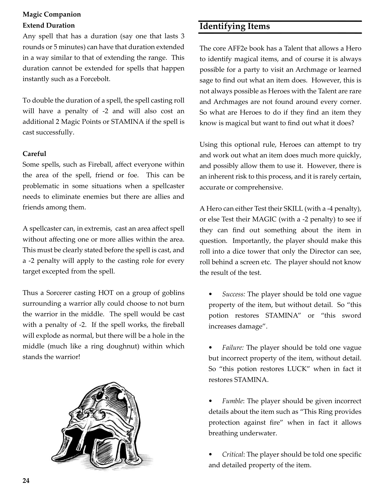
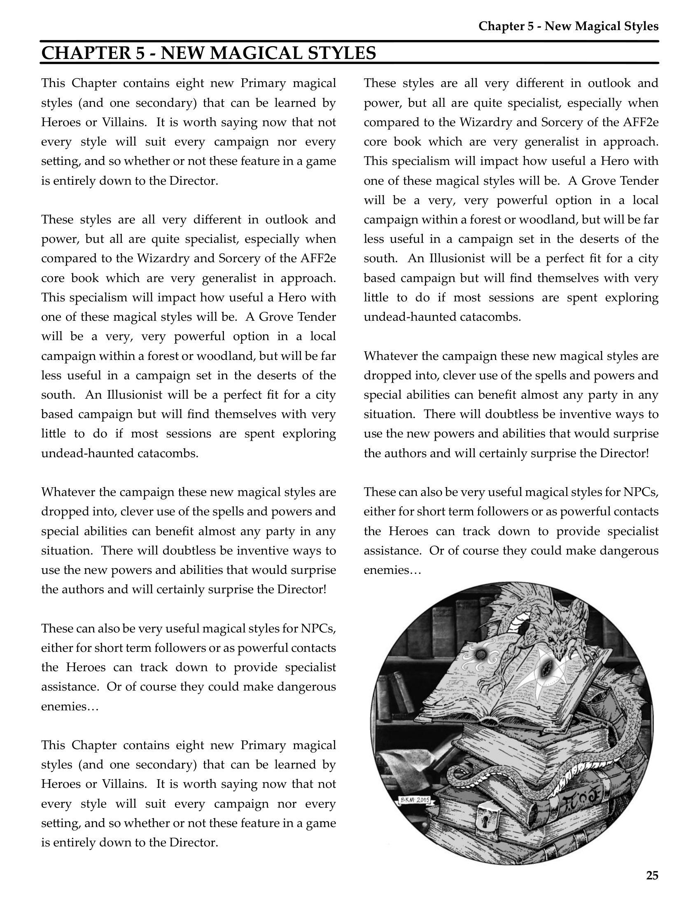
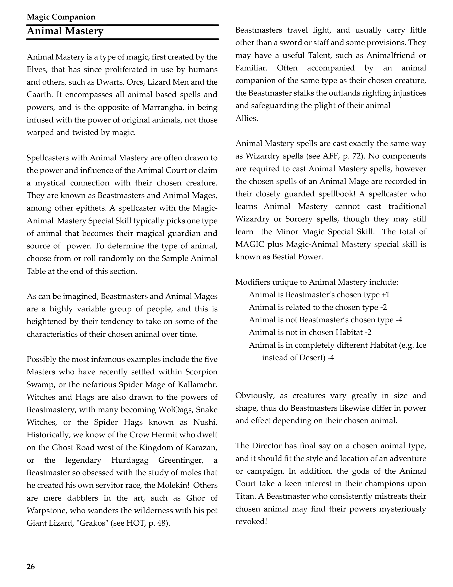
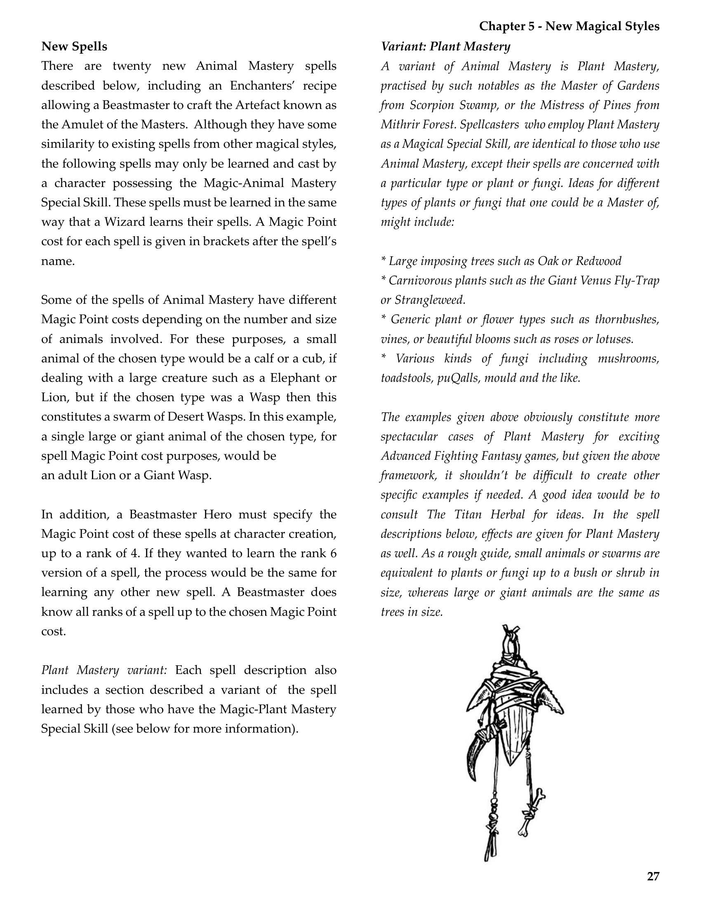
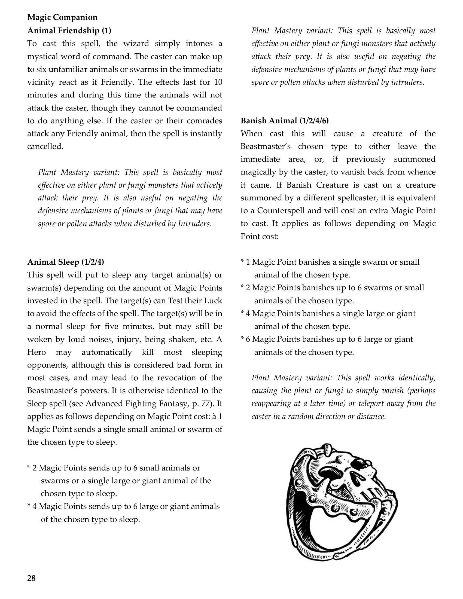
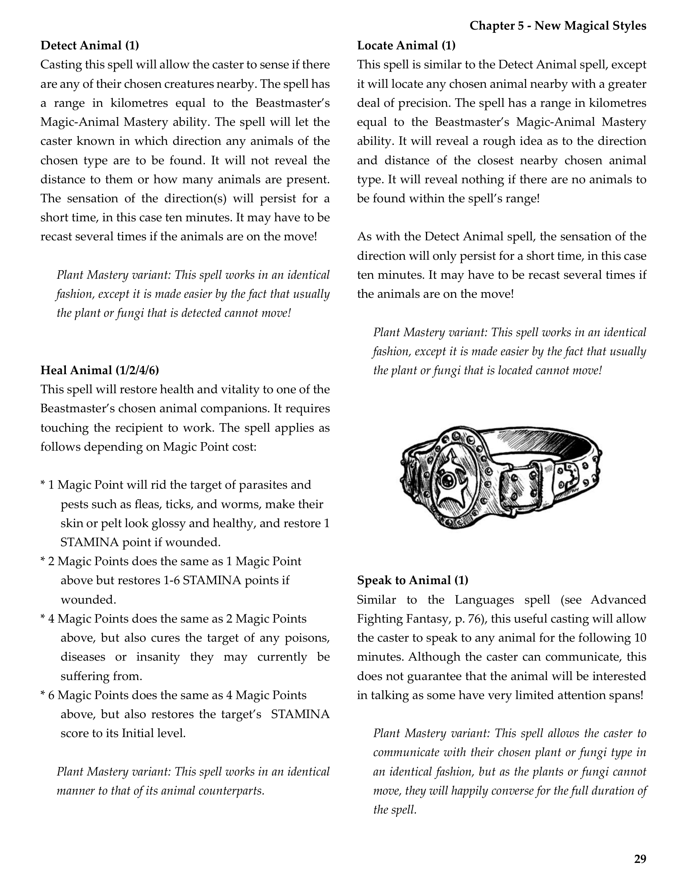
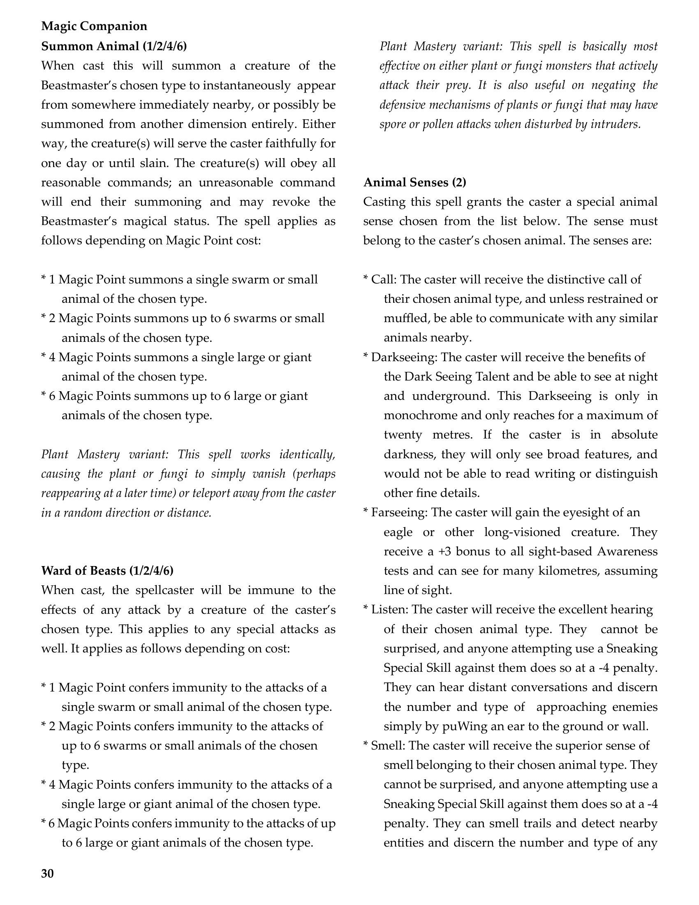
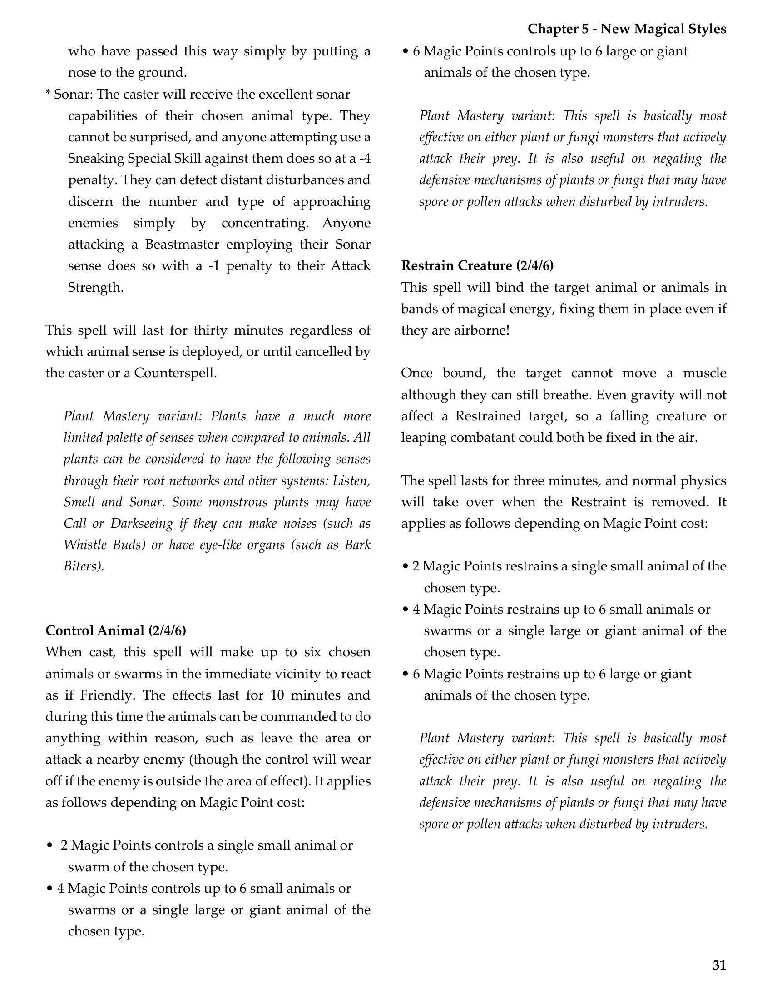
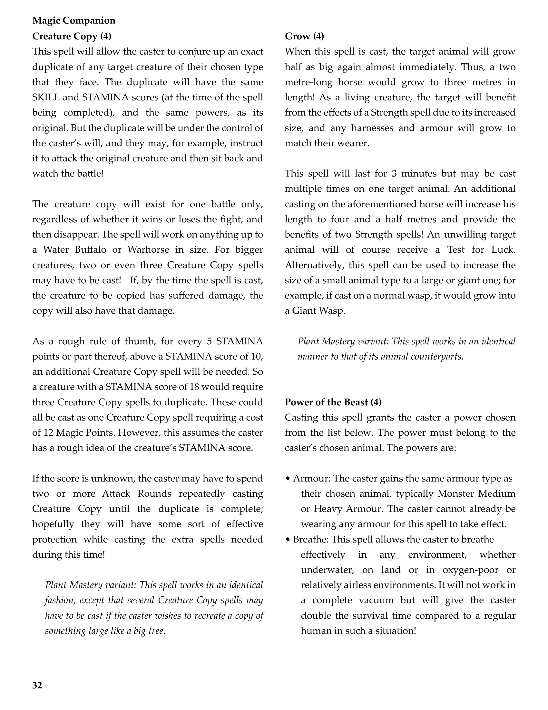
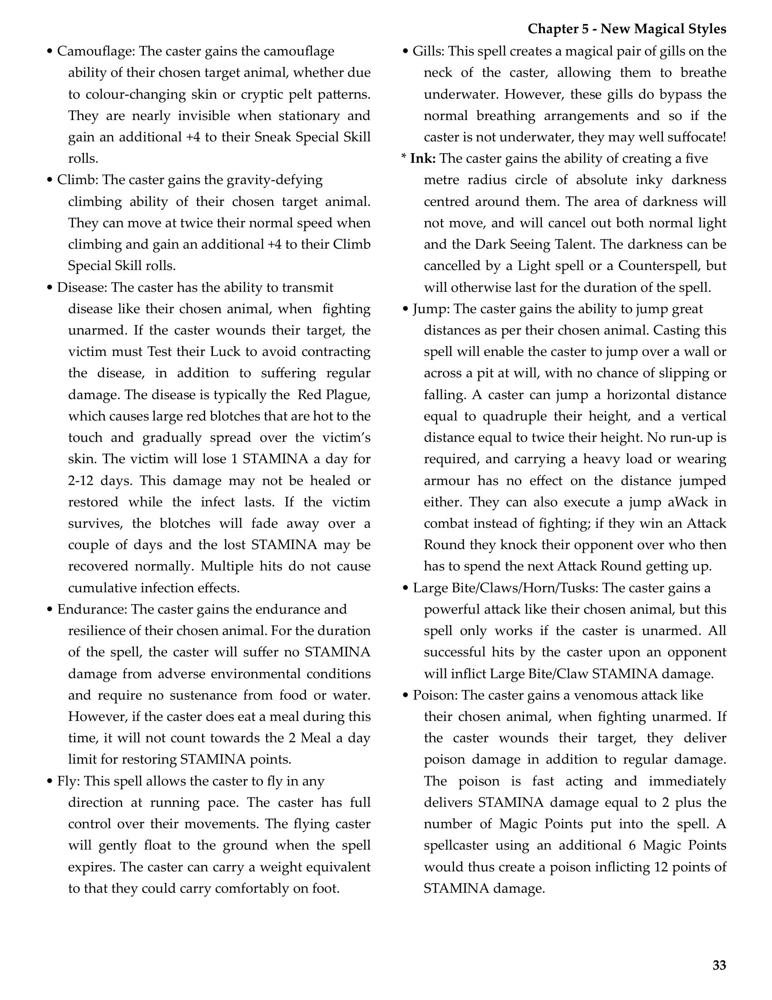
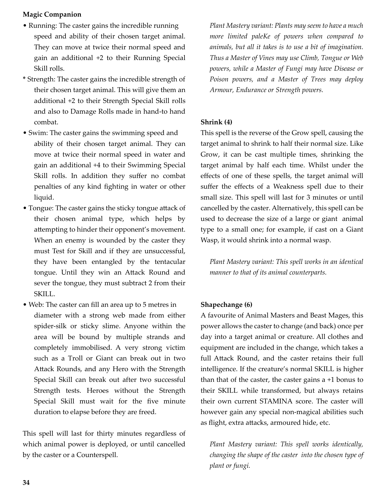
