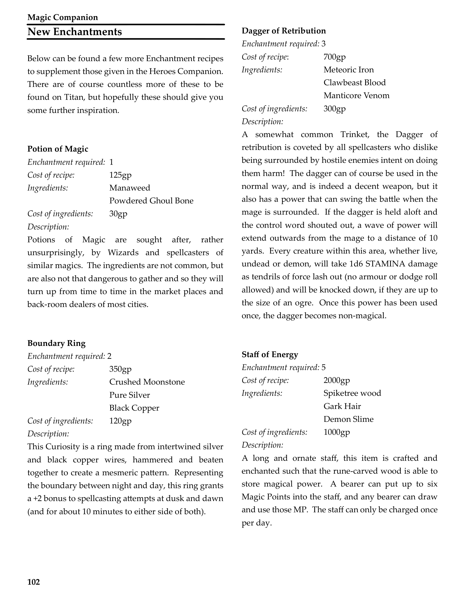
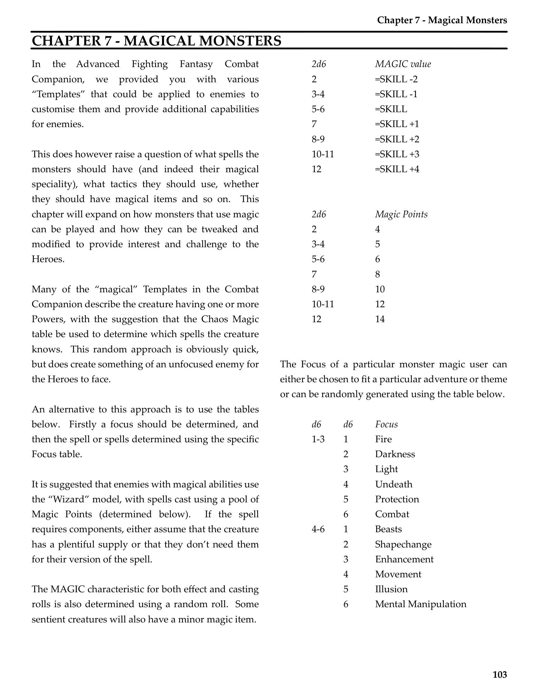
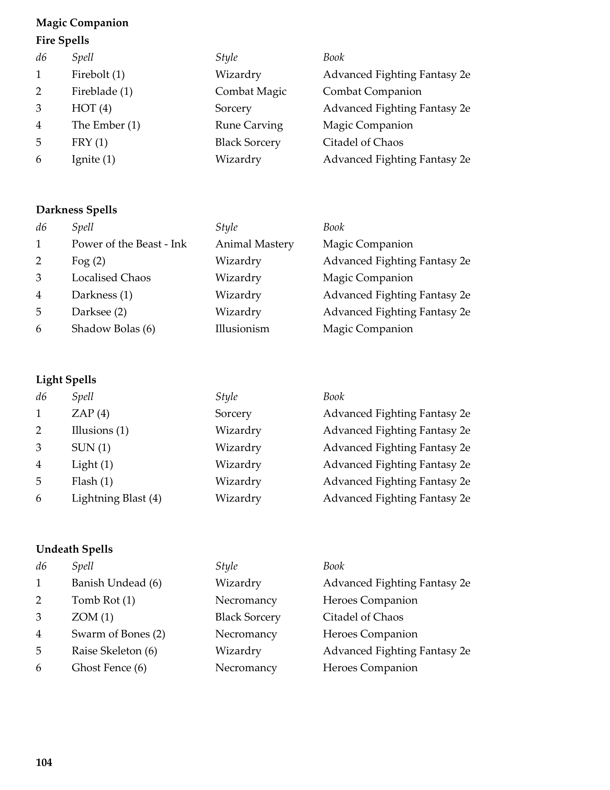
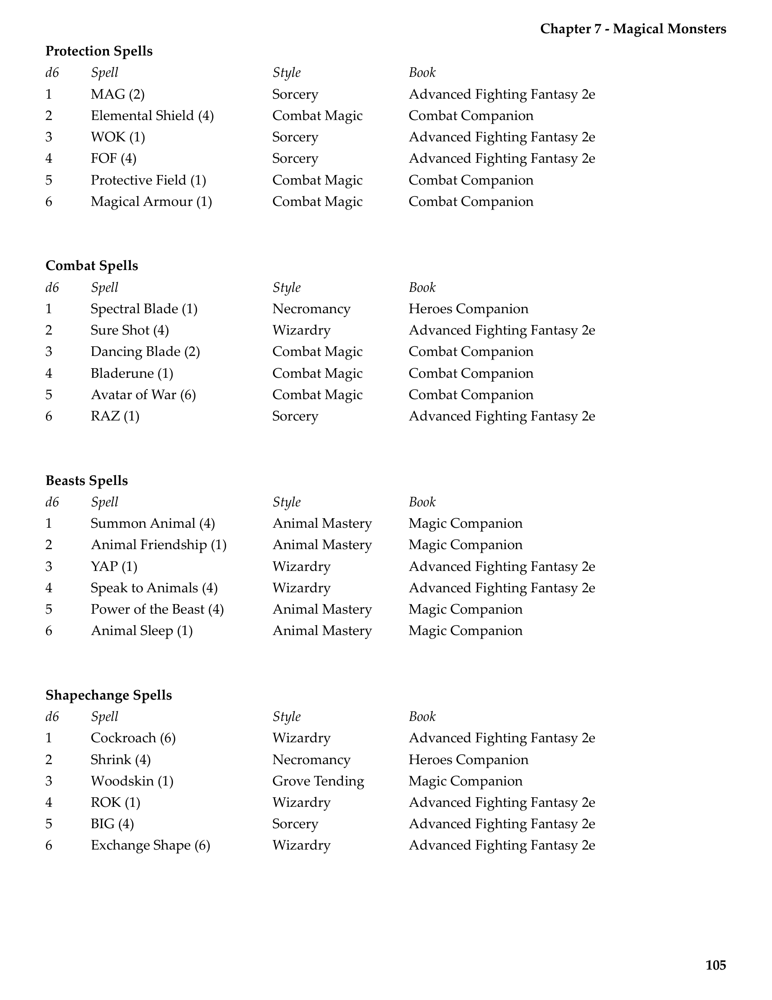
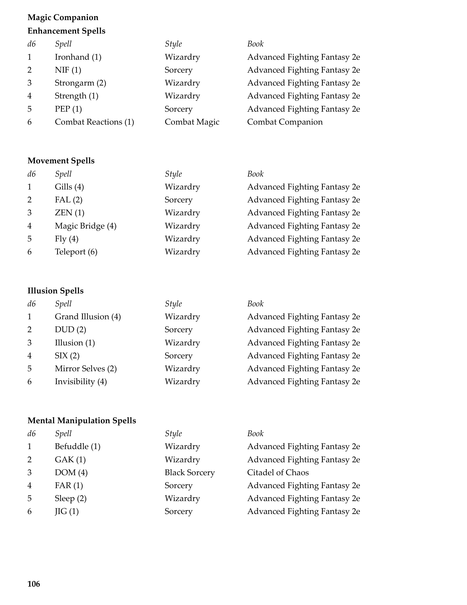
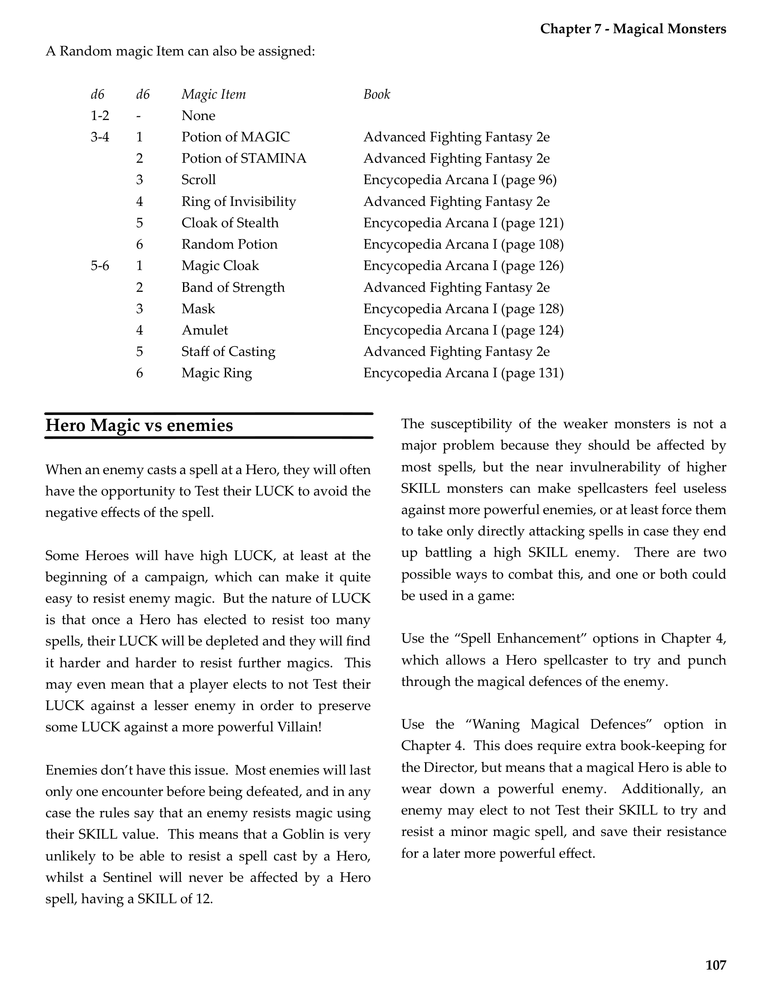
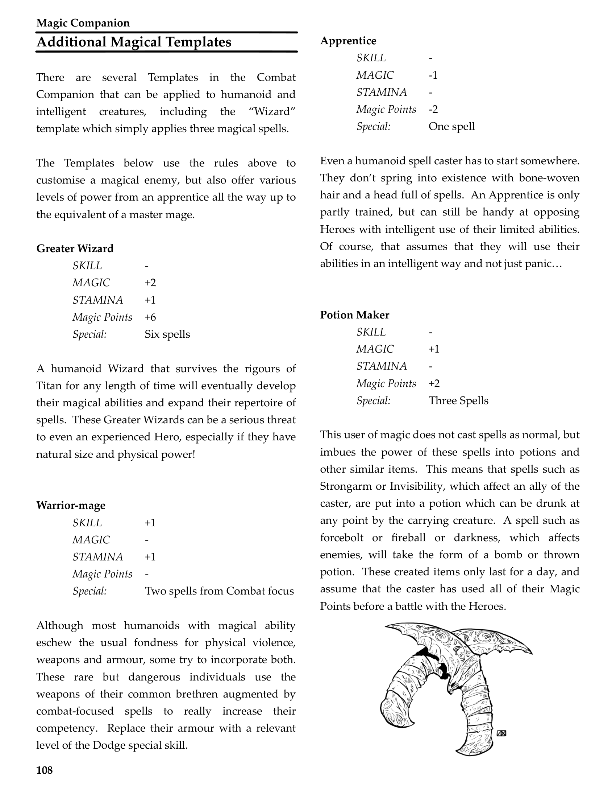
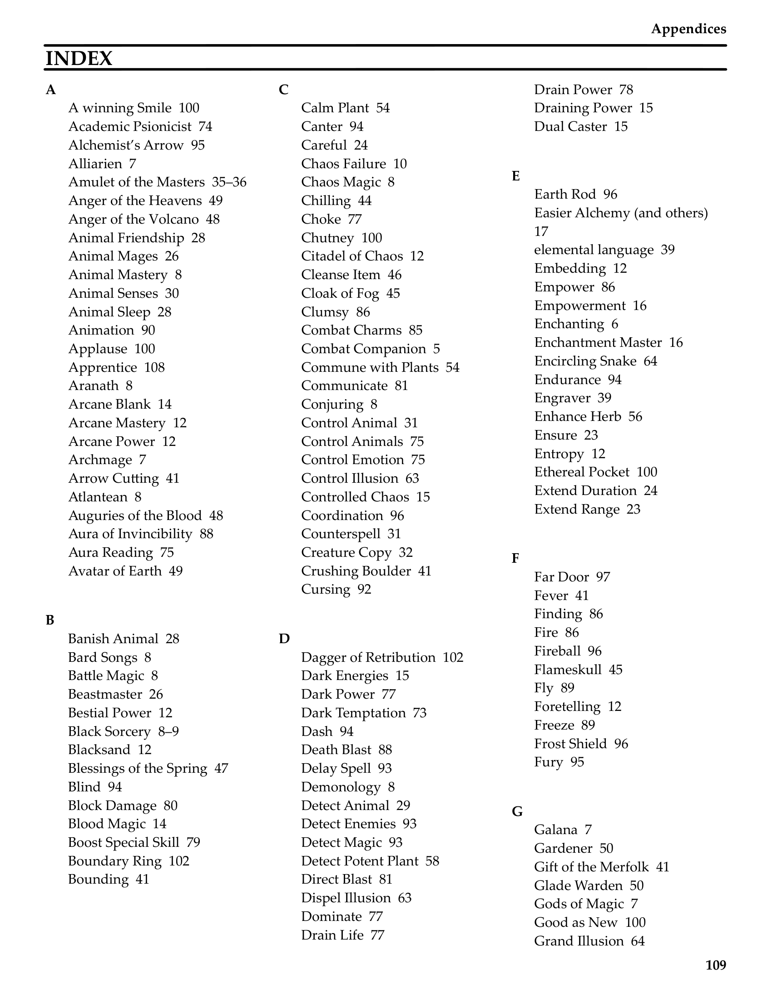
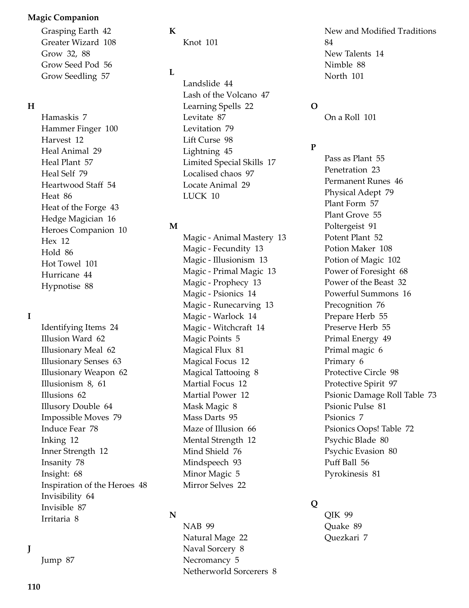
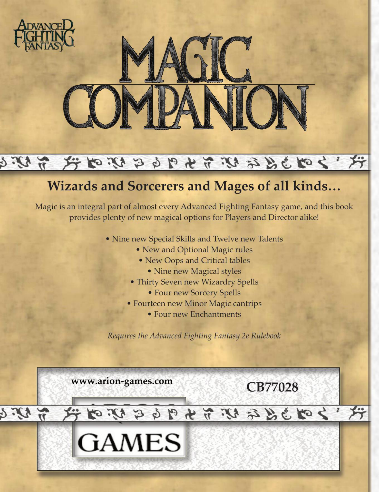

# Magical Monsters

**Source:** CB77028 - Magic Companion  
**Pages:** 103-113

Chapter 7: Magical Monsters

---

## New Enchantments

Below can be found a few more Enchantment recipes to supplement those given in the Heroes Companion. There are of course countless more of these to be found on Titan, but hopefully these should give you some further inspiration.

### Potion of Magic
- **Enchantment required:** 1
- **Cost of recipe:** 125gp
- **Ingredients:** 
  - Manaweed
  - Powdered Ghoul Bone
- **Cost of ingredients:** 30gp
- **Description:** Potions of Magic are sought after, rather unsurprisingly, by Wizards and spellcasters of similar magics. The ingredients are not common, but are also not that dangerous to gather and so they will turn up from time to time in the market places and back-room dealers of most cities.

### Boundary Ring
- **Enchantment required:** 2
- **Cost of recipe:** 350gp
- **Ingredients:**
  - Crushed Moonstone
  - Pure Silver
  - Black Copper
- **Cost of ingredients:** 120gp
- **Description:** This Curiosity is a ring made from intertwined silver and black copper wires, hammered and beaten together to create a mesmeric pattern. Representing the boundary between night and day, this ring grants a +2 bonus to spellcasting attempts at dusk and dawn (and for about 10 minutes to either side of both).

### Dagger of Retribution
- **Enchantment required:** 3
- **Cost of recipe:** 700gp
- **Ingredients:**
  - Meteoric Iron
  - Clawbeast Blood
  - Manticore Venom
- **Cost of ingredients:** 300gp
- **Description:** A somewhat common Trinket, the Dagger of retribution is coveted by all spellcasters who dislike being surrounded by hostile enemies intent on doing them harm! The dagger can of course be used in the normal way, and is indeed a decent weapon, but it also has a power that can swing the battle when the mage is surrounded. If the dagger is held aloft and the control word shouted out, a wave of power will extend outwards from the mage to a distance of 10 yards. Every creature within this area, whether live, undead or demon, will take 1d6 STAMINA damage as tendrils of force lash out (no armour or dodge roll allowed) and will be knocked down, if they are up to the size of an ogre. Once this power has been used once, the dagger becomes non-magical.

### Staff of Energy
- **Enchantment required:** 5
- **Cost of recipe:** 2000gp
- **Ingredients:**
  - Spiketree wood
  - Gark Hair
  - Demon Slime
- **Cost of ingredients:** 1000gp
- **Description:** A long and ornate staff, this item is crafted and enchanted such that the rune-carved wood is able to store magical power. A bearer can put up to six Magic Points into the staff, and any bearer can draw and use those MP. The staff can only be charged once per day.

---

## Chapter 7 - Magical Monsters

In the Advanced Fighting Fantasy Combat Companion, we provided you with various "Templates" that could be applied to enemies to customise them and provide additional capabilities for enemies.

This does however raise a question of what spells the monsters should have (and indeed their magical speciality), what tactics they should use, whether they should have magical items and so on. This chapter will expand on how monsters that use magic can be played and how they can be tweaked and modified to provide interest and challenge to the Heroes.

Many of the "magical" Templates in the Combat Companion describe the creature having one or more Powers, with the suggestion that the Chaos Magic table be used to determine which spells the creature knows. This random approach is obviously quick, but does create something of an unfocused enemy for the Heroes to face.

An alternative to this approach is to use the tables below. Firstly a focus should be determined, and then the spell or spells determined using the specific Focus table.

It is suggested that enemies with magical abilities use the "Wizard" model, with spells cast using a pool of Magic Points (determined below). If the spell requires components, either assume that the creature has a plentiful supply or that they don't need them for their version of the spell.

The MAGIC characteristic for both effect and casting rolls is also determined using a random roll. Some sentient creatures will also have a minor magic item.

### MAGIC Value

| 2d6 | MAGIC value |
|-----|-------------|
| 2 | SKILL -2 |
| 3-4 | SKILL -1 |
| 5-6 | SKILL |
| 7 | SKILL +1 |
| 8-9 | SKILL +2 |
| 10-11 | SKILL +3 |
| 12 | SKILL +4 |

### Magic Points

| 2d6 | Magic Points |
|-----|-------------|
| 2 | 4 |
| 3-4 | 5 |
| 5-6 | 6 |
| 7 | 8 |
| 8-9 | 10 |
| 10-11 | 12 |
| 12 | 14 |

The Focus of a particular monster magic user can either be chosen to fit a particular adventure or theme or can be randomly generated using the table below.

### Focus Table

| d6 | d6 | Focus |
|----|----|-------|
| 1-3 | 1 | Fire |
| | 2 | Darkness |
| | 3 | Light |
| | 4 | Undeath |
| | 5 | Protection |
| | 6 | Combat |
| 4-6 | 1 | Beasts |
| | 2 | Shapechange |
| | 3 | Enhancement |
| | 4 | Movement |
| | 5 | Illusion |
| | 6 | Mental Manipulation |

### Fire Spells

| d6 | Spell | Style | Book |
|----|-------|-------|------|
| 1 | Firebolt (1) | Wizardry | Advanced Fighting Fantasy 2e |
| 2 | Fireblade (1) | Combat Magic | Combat Companion |
| 3 | HOT (4) | Sorcery | Advanced Fighting Fantasy 2e |
| 4 | The Ember (1) | Rune Carving | Magic Companion |
| 5 | FRY (1) | Black Sorcery | Citadel of Chaos |
| 6 | Ignite (1) | Wizardry | Advanced Fighting Fantasy 2e |

### Darkness Spells

| d6 | Spell | Style | Book |
|----|-------|-------|------|
| 1 | Power of the Beast - Ink | Animal Mastery | Magic Companion |
| 2 | Fog (2) | Wizardry | Advanced Fighting Fantasy 2e |
| 3 | Localised Chaos | Wizardry | Magic Companion |
| 4 | Darkness (1) | Wizardry | Advanced Fighting Fantasy 2e |
| 5 | Darksee (2) | Wizardry | Advanced Fighting Fantasy 2e |
| 6 | Shadow Bolas (6) | Illusionism | Magic Companion |

### Light Spells

| d6 | Spell | Style | Book |
|----|-------|-------|------|
| 1 | ZAP (4) | Sorcery | Advanced Fighting Fantasy 2e |
| 2 | Illusions (1) | Wizardry | Advanced Fighting Fantasy 2e |
| 3 | SUN (1) | Wizardry | Advanced Fighting Fantasy 2e |
| 4 | Light (1) | Wizardry | Advanced Fighting Fantasy 2e |
| 5 | Flash (1) | Wizardry | Advanced Fighting Fantasy 2e |
| 6 | Lightning Blast (4) | Wizardry | Advanced Fighting Fantasy 2e |

### Undeath Spells

| d6 | Spell | Style | Book |
|----|-------|-------|------|
| 1 | Banish Undead (6) | Wizardry | Advanced Fighting Fantasy 2e |
| 2 | Tomb Rot (1) | Necromancy | Heroes Companion |
| 3 | ZOM (1) | Black Sorcery | Citadel of Chaos |
| 4 | Swarm of Bones (2) | Necromancy | Heroes Companion |
| 5 | Raise Skeleton (6) | Wizardry | Advanced Fighting Fantasy 2e |
| 6 | Ghost Fence (6) | Necromancy | Heroes Companion |

### Protection Spells

| d6 | Spell | Style | Book |
|----|-------|-------|------|
| 1 | MAG (2) | Sorcery | Advanced Fighting Fantasy 2e |
| 2 | Elemental Shield (4) | Combat Magic | Combat Companion |
| 3 | WOK (1) | Sorcery | Advanced Fighting Fantasy 2e |
| 4 | FOF (4) | Sorcery | Advanced Fighting Fantasy 2e |
| 5 | Protective Field (1) | Combat Magic | Combat Companion |
| 6 | Magical Armour (1) | Combat Magic | Combat Companion |

### Combat Spells

| d6 | Spell | Style | Book |
|----|-------|-------|------|
| 1 | Spectral Blade (1) | Necromancy | Heroes Companion |
| 2 | Sure Shot (4) | Wizardry | Advanced Fighting Fantasy 2e |
| 3 | Dancing Blade (2) | Combat Magic | Combat Companion |
| 4 | Bladerune (1) | Combat Magic | Combat Companion |
| 5 | Avatar of War (6) | Combat Magic | Combat Companion |
| 6 | RAZ (1) | Sorcery | Advanced Fighting Fantasy 2e |

### Beasts Spells

| d6 | Spell | Style | Book |
|----|-------|-------|------|
| 1 | Summon Animal (4) | Animal Mastery | Magic Companion |
| 2 | Animal Friendship (1) | Animal Mastery | Magic Companion |
| 3 | YAP (1) | Wizardry | Advanced Fighting Fantasy 2e |
| 4 | Speak to Animals (4) | Wizardry | Advanced Fighting Fantasy 2e |
| 5 | Power of the Beast (4) | Animal Mastery | Magic Companion |
| 6 | Animal Sleep (1) | Animal Mastery | Magic Companion |

### Shapechange Spells

| d6 | Spell | Style | Book |
|----|-------|-------|------|
| 1 | Cockroach (6) | Wizardry | Advanced Fighting Fantasy 2e |
| 2 | Shrink (4) | Necromancy | Heroes Companion |
| 3 | Woodskin (1) | Grove Tending | Magic Companion |
| 4 | ROK (1) | Wizardry | Advanced Fighting Fantasy 2e |
| 5 | BIG (4) | Sorcery | Advanced Fighting Fantasy 2e |
| 6 | Exchange Shape (6) | Wizardry | Advanced Fighting Fantasy 2e |

### Enhancement Spells

| d6 | Spell | Style | Book |
|----|-------|-------|------|
| 1 | Ironhand (1) | Wizardry | Advanced Fighting Fantasy 2e |
| 2 | NIF (1) | Sorcery | Advanced Fighting Fantasy 2e |
| 3 | Strongarm (2) | Wizardry | Advanced Fighting Fantasy 2e |
| 4 | Strength (1) | Wizardry | Advanced Fighting Fantasy 2e |
| 5 | PEP (1) | Sorcery | Advanced Fighting Fantasy 2e |
| 6 | Combat Reactions (1) | Combat Magic | Combat Companion |

### Movement Spells

| d6 | Spell | Style | Book |
|----|-------|-------|------|
| 1 | Gills (4) | Wizardry | Advanced Fighting Fantasy 2e |
| 2 | FAL (2) | Sorcery | Advanced Fighting Fantasy 2e |
| 3 | ZEN (1) | Wizardry | Advanced Fighting Fantasy 2e |
| 4 | Magic Bridge (4) | Wizardry | Advanced Fighting Fantasy 2e |
| 5 | Fly (4) | Wizardry | Advanced Fighting Fantasy 2e |
| 6 | Teleport (6) | Wizardry | Advanced Fighting Fantasy 2e |

### Illusion Spells

| d6 | Spell | Style | Book |
|----|-------|-------|------|
| 1 | Grand Illusion (4) | Wizardry | Advanced Fighting Fantasy 2e |
| 2 | DUD (2) | Sorcery | Advanced Fighting Fantasy 2e |
| 3 | Illusion (1) | Wizardry | Advanced Fighting Fantasy 2e |
| 4 | SIX (2) | Sorcery | Advanced Fighting Fantasy 2e |
| 5 | Mirror Selves (2) | Wizardry | Advanced Fighting Fantasy 2e |
| 6 | Invisibility (4) | Wizardry | Advanced Fighting Fantasy 2e |

### Mental Manipulation Spells

| d6 | Spell | Style | Book |
|----|-------|-------|------|
| 1 | Befuddle (1) | Wizardry | Advanced Fighting Fantasy 2e |
| 2 | GAK (1) | Wizardry | Advanced Fighting Fantasy 2e |
| 3 | DOM (4) | Black Sorcery | Citadel of Chaos |
| 4 | FAR (1) | Sorcery | Advanced Fighting Fantasy 2e |
| 5 | Sleep (2) | Wizardry | Advanced Fighting Fantasy 2e |
| 6 | JIG (1) | Sorcery | Advanced Fighting Fantasy 2e |

### Random Magic Item

A Random magic Item can also be assigned:

| d6 | d6 | Magic Item | Book |
|----|----|------------|------|
| 1-2 | - | None | - |
| 3-4 | 1 | Potion of MAGIC | Advanced Fighting Fantasy 2e |
| | 2 | Potion of STAMINA | Advanced Fighting Fantasy 2e |
| | 3 | Scroll | Encyclopedia Arcana I (page 96) |
| | 4 | Ring of Invisibility | Advanced Fighting Fantasy 2e |
| | 5 | Cloak of Stealth | Encyclopedia Arcana I (page 121) |
| | 6 | Random Potion | Encyclopedia Arcana I (page 108) |
| 5-6 | 1 | Magic Cloak | Encyclopedia Arcana I (page 126) |
| | 2 | Band of Strength | Advanced Fighting Fantasy 2e |
| | 3 | Mask | Encyclopedia Arcana I (page 128) |
| | 4 | Amulet | Encyclopedia Arcana I (page 124) |
| | 5 | Staff of Casting | Advanced Fighting Fantasy 2e |
| | 6 | Magic Ring | Encyclopedia Arcana I (page 131) |

---

## Hero Magic vs Enemies

When an enemy casts a spell at a Hero, they will often have the opportunity to Test their LUCK to avoid the negative effects of the spell.

Some Heroes will have high LUCK, at least at the beginning of a campaign, which can make it quite easy to resist enemy magic. But the nature of LUCK is that once a Hero has elected to resist too many spells, their LUCK will be depleted and they will find it harder and harder to resist further magics. This may even mean that a player elects to not Test their LUCK against a lesser enemy in order to preserve some LUCK against a more powerful Villain!

Enemies don't have this issue. Most enemies will last only one encounter before being defeated, and in any case the rules say that an enemy resists magic using their SKILL value. This means that a Goblin is very unlikely to be able to resist a spell cast by a Hero, whilst a Sentinel will never be affected by a Hero spell, having a SKILL of 12.

The susceptibility of the weaker monsters is not a major problem because they should be affected by most spells, but the near invulnerability of higher SKILL monsters can make spellcasters feel useless against more powerful enemies, or at least force them to take only directly attacking spells in case they end up battling a high SKILL enemy. There are two possible ways to combat this, and one or both could be used in a game:

1. **Use the "Spell Enhancement" options in Chapter 4**, which allows a Hero spellcaster to try and punch through the magical defences of the enemy.

2. **Use the "Waning Magical Defences" option in Chapter 4.** This does require extra book-keeping for the Director, but means that a magical Hero is able to wear down a powerful enemy. Additionally, an enemy may elect to not Test their SKILL to try and resist a minor magic spell, and save their resistance for a later more powerful effect.

---

## Additional Magical Templates

There are several Templates in the Combat Companion that can be applied to humanoid and intelligent creatures, including the "Wizard" template which simply applies three magical spells. The Templates below use the rules above to customise a magical enemy, but also offer various levels of power from an apprentice all the way up to the equivalent of a master mage.

### Apprentice
- **SKILL** - (no change)
- **MAGIC** -1
- **STAMINA** - (no change)
- **Magic Points** -2
- **Special:** One spell

Even a humanoid spell caster has to start somewhere. They don't spring into existence with bone-woven hair and a head full of spells. An Apprentice is only partly trained, but can still be handy at opposing Heroes with intelligent use of their limited abilities. Of course, that assumes that they will use their abilities in an intelligent way and not just panic…

### Greater Wizard
- **SKILL** - (no change)
- **MAGIC** +2
- **STAMINA** +1
- **Magic Points** +6
- **Special:** Six spells

A humanoid Wizard that survives the rigours of Titan for any length of time will eventually develop their magical abilities and expand their repertoire of spells. These Greater Wizards can be a serious threat to even an experienced Hero, especially if they have natural size and physical power!

### Warrior-mage
- **SKILL** +1
- **MAGIC** - (no change)
- **STAMINA** +1
- **Magic Points** - (no change)
- **Special:** Two spells from Combat focus

Although most humanoids with magical ability eschew the usual fondness for physical violence, weapons and armour, some try to incorporate both. These rare but dangerous individuals use the weapons of their common brethren augmented by combat-focused spells to really increase their competency. Replace their armour with a relevant level of the Dodge special skill.

### Potion Maker
- **SKILL** - (no change)
- **MAGIC** +1
- **STAMINA** - (no change)
- **Magic Points** +2
- **Special:** Three Spells

This user of magic does not cast spells as normal, but imbues the power of these spells into potions and other similar items. This means that spells such as Strongarm or Invisibility, which affect an ally of the caster, are put into a potion which can be drunk at any point by the carrying creature. A spell such as forcebolt or fireball or darkness, which affects enemies, will take the form of a bomb or thrown potion. These created items only last for a day, and assume that the caster has used all of their Magic Points before a battle with the Heroes.

---

## Page Images

