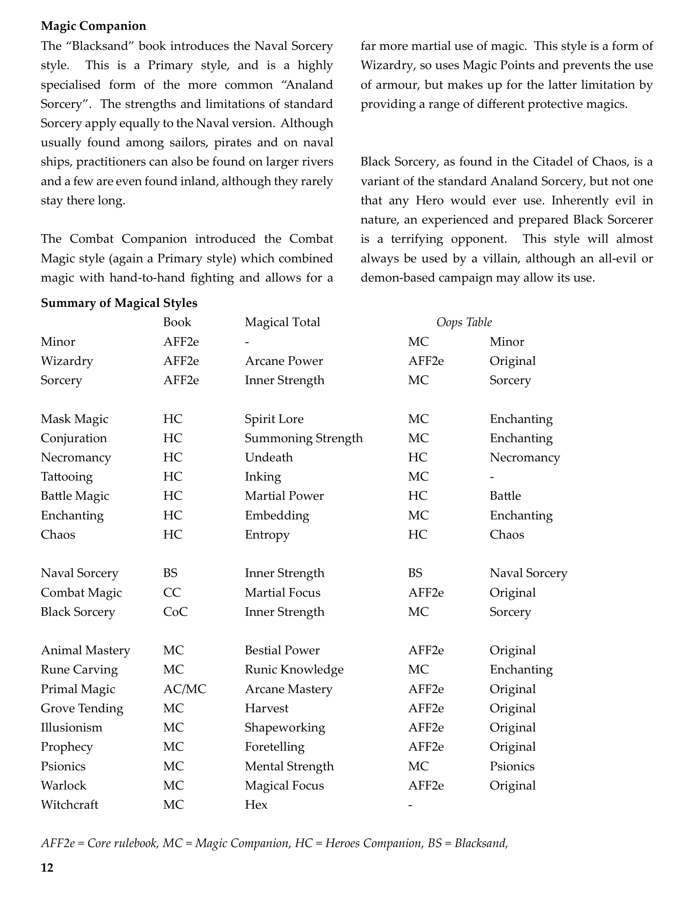
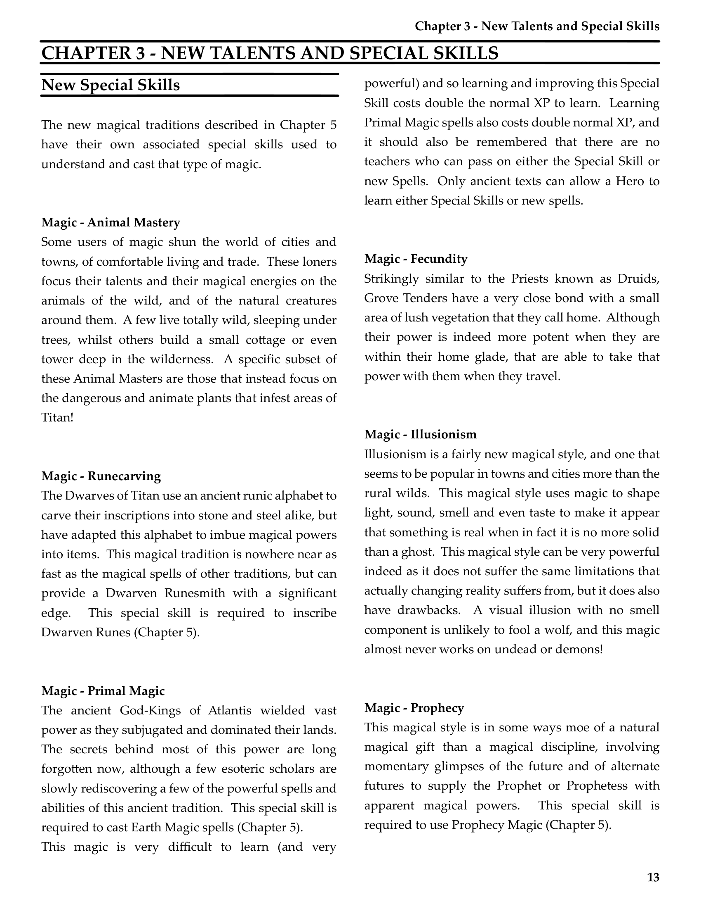
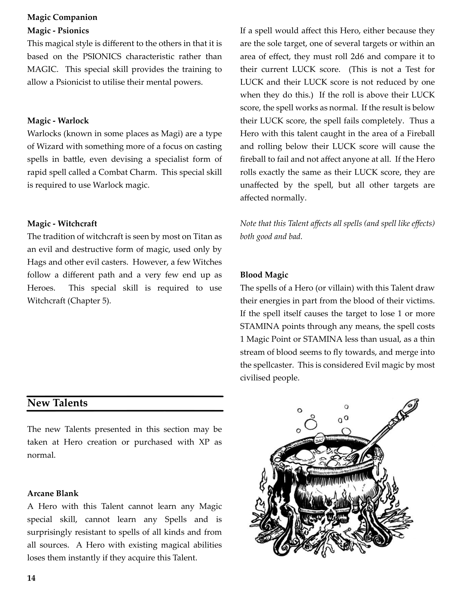
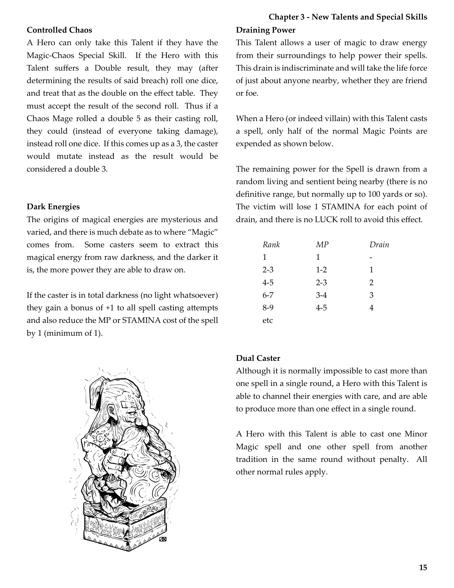

# New Talents And Special Skills

**Source:** CB77028 - Magic Companion  
**Pages:** 13-16

Chapter 3: New Talents and Special Skills

---

## Summary of Magical Styles

| Book | Magical Style | Total | Oops Table |
|------|--------------|-------|------------|
| AF2e | Minor | MC | Minor |
| AF2e | Wizardry | Arcane Power | AF2e Original |
| AF2e | Sorcery | Inner Strength | MC Sorcery |
| HC | Mask Magic | Spirit Lore | MC Enchanting |
| HC | Conjuration | Summoning Strength | MC Enchanting |
| HC | Necromancy | Undeath | HC Necromancy |
| HC | Tattooing | Inking | MC - |
| HC | Battle Magic | Martial Power | HC Battle |
| HC | Enchanting | Embedding | MC Enchanting |
| HC | Chaos | Entropy | HC Chaos |
| BS | Naval Sorcery | Inner Strength | BS Naval Sorcery |
| C | Combat Magic | Martial Focus | AF2e Original |
| CoC | Black Sorcery | Inner Strength | MC Sorcery |
| MC | Animal Mastery | Bestial Power | AF2e Original |
| MC | Rune Carving | Runic Knowledge | MC Enchanting |
| AC/MC | Primal Magic | Arcane Mastery | AF2e Original |
| MC | Grove Tending | Harvest | AF2e Original |
| MC | Illusionism | Shapeworking | AF2e Original |
| MC | Prophecy | Foretelling | AF2e Original |
| MC | Psionics | Mental Strength | MC Psionics |
| MC | Warlock | Magical Focus | AF2e Original |
| MC | Witchcraft | Hex | - |

*AF2e = Core rulebook, MC = Magic Companion, HC = Heroes Companion, BS = Blacksand, C = Combat Companion, CoC = Citadel of Chaos, AC = Allansia Companion*

---

## Chapter 3 - New Talents And Special Skills

### New Special Skills

The new magical traditions described in Chapter 5 have their own associated special skills used to understand and cast that type of magic.

- [Magic - Animal Mastery](./Special-Skill-Animal-Mastery.md)
- [Magic - Runecarving](./Special-Skill-Runecarving.md)
- [Magic - Primal Magic](./Special-Skill-Primal-Magic.md)
- [Magic - Fecundity](./Special-Skill-Fecundity.md)
- [Magic - Illusionism](./Special-Skill-Illusionism.md)
- [Magic - Prophecy](./Special-Skill-Prophecy.md)
- [Magic - Psionics](./Special-Skill-Psionics.md)
- [Magic - Warlock](./Special-Skill-Warlock.md)
- [Magic - Witchcraft](./Special-Skill-Witchcraft.md)

---

## New Talents

The new Talents presented in this section may be taken at Hero creation or purchased with XP as normal.

- [Arcane Blank](../../Talents/Arcane-Blank.md)
- [Blood Magic](../../Talents/Blood-Magic.md)
- [Controlled Chaos](../../Talents/Controlled-Chaos.md)
- [Dark Energies](../../Talents/Dark-Energies.md)
- [Draining Power](../../Talents/Draining-Power.md)
- [Dual Caster](../../Talents/Dual-Caster.md)
- [Empowerment](../../Talents/Empowerment.md)
- [Enchantment Master](../../Talents/Enchantment-Master.md)
- [Hedge Magician](../../Talents/Hedge-Magician.md)
- [Powerful Summons](../../Talents/Powerful-Summons.md)
- [Soul Store](../../Talents/Soul-Store.md)
- [Spell Mastery](../../Talents/Spell-Mastery.md)

---

## Page Images

