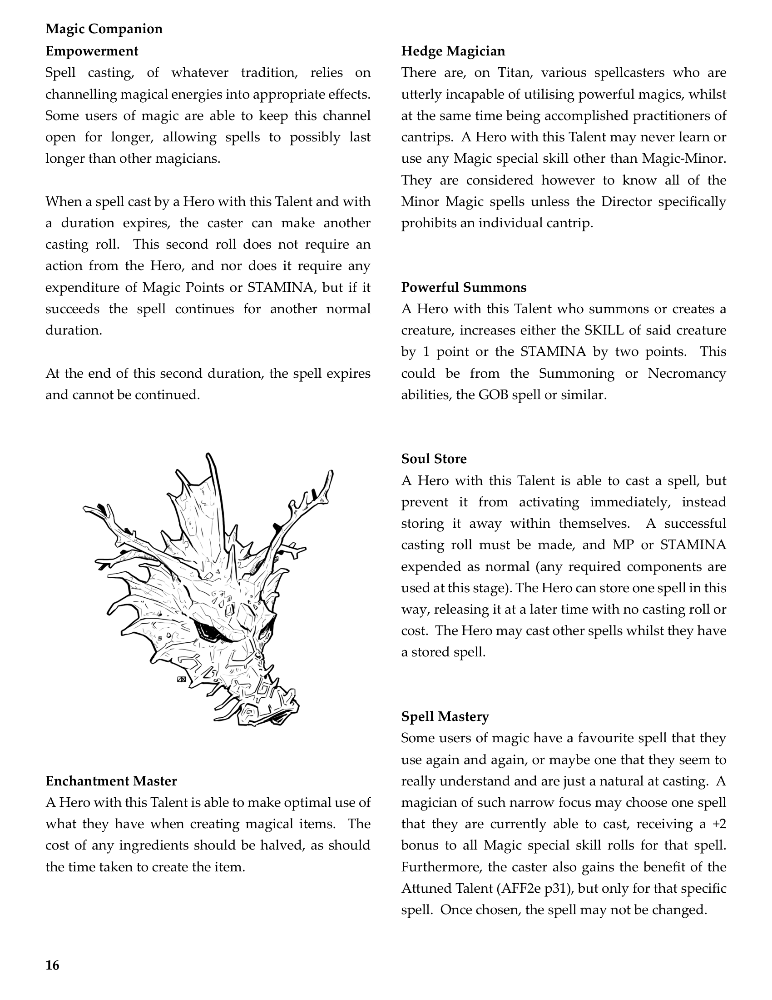
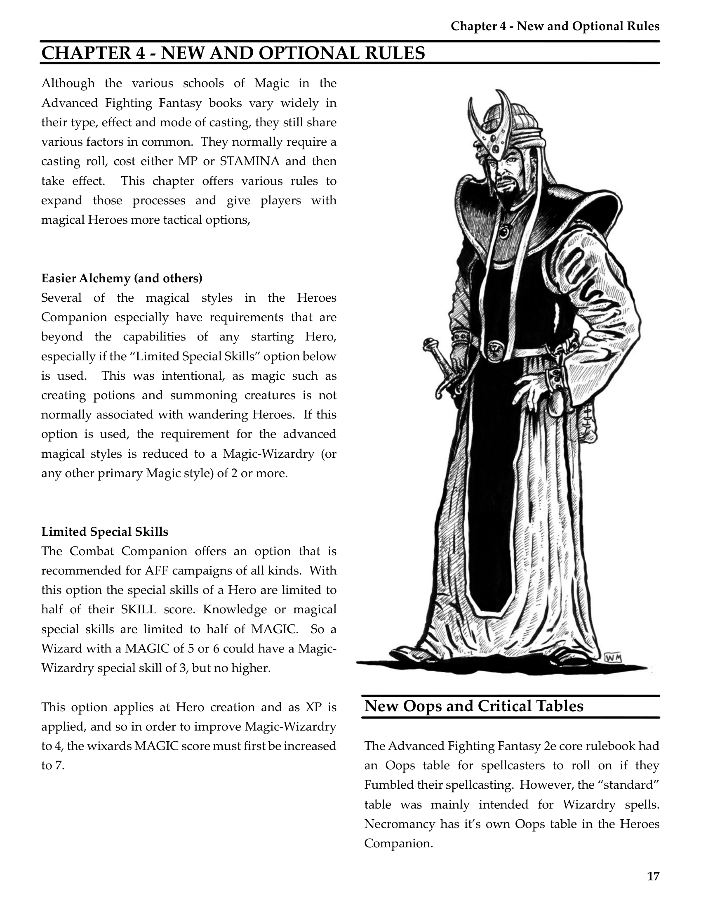
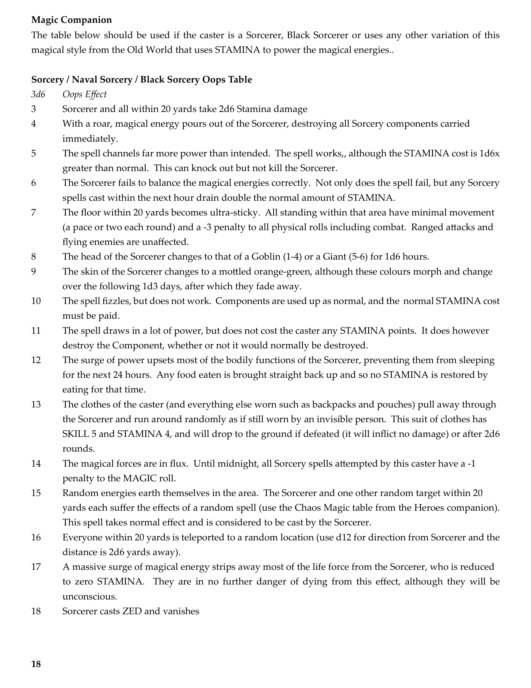
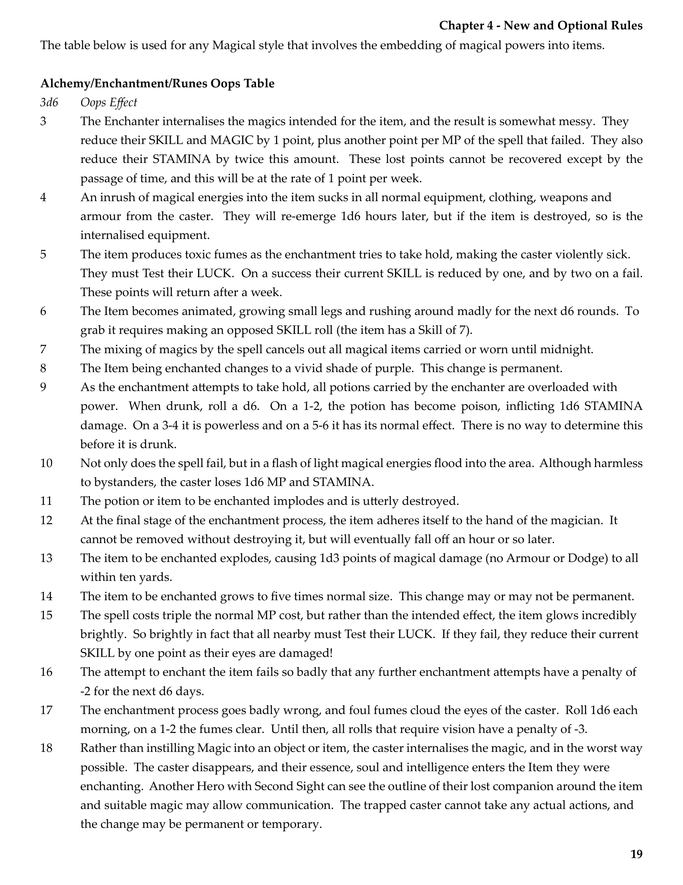
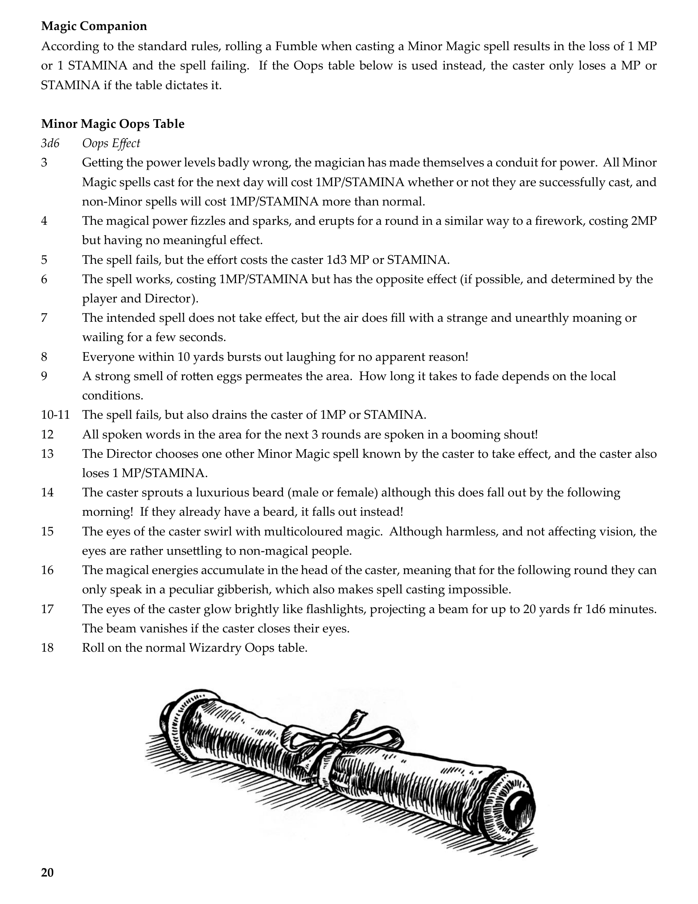
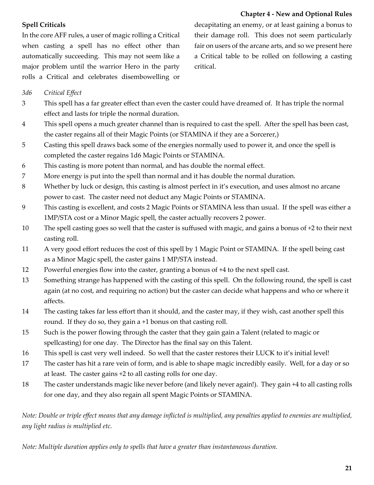
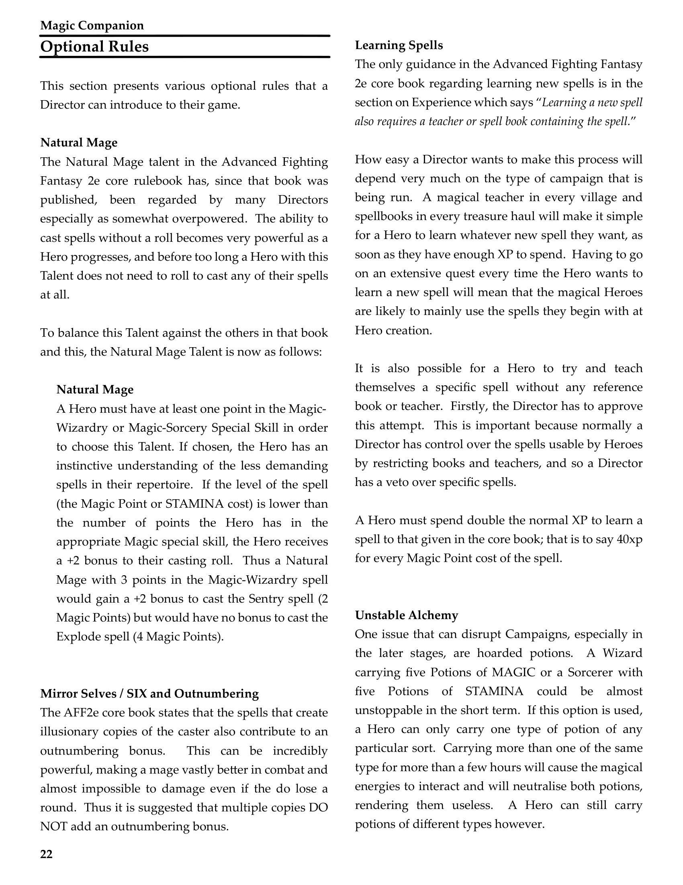
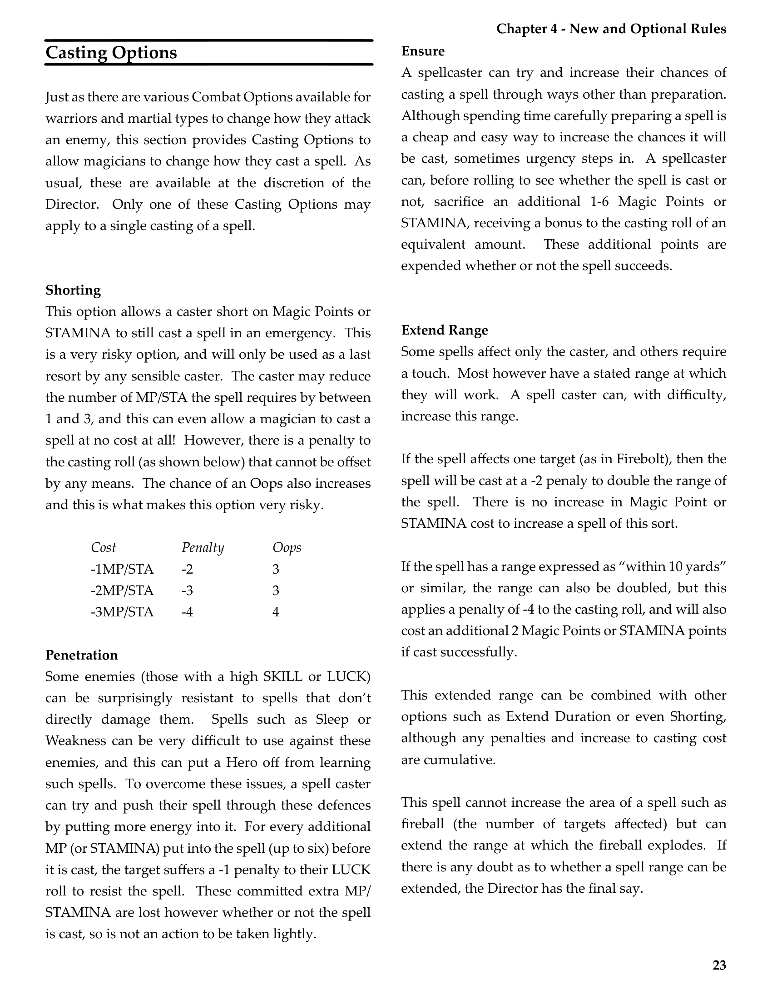

# New And Optional Rules

**Source:** CB77028 - Magic Companion  
**Pages:** 17-24

Chapter 4: New and Optional Rules

---

## Chapter 4 - New And Optional Rules

Although the various schools of Magic in the Advanced Fighting Fantasy books vary widely in their type, effect and mode of casting, they still share various factors in common. They normally require a casting roll, cost either MP or STAMINA and then take effect. This chapter offers various rules to expand those processes and give players with magical Heroes more tactical options.

### Easier Alchemy (and others)

Several of the magical styles in the Heroes Companion especially have requirements that are beyond the capabilities of any starting Hero, especially if the "Limited Special Skills" option below is used. This was intentional, as magic such as creating potions and summoning creatures is not normally associated with wandering Heroes. If this option is used, the requirement for the advanced magical styles is reduced to a Magic-Wizardry (or any other primary Magic style) of 2 or more.

### Limited Special Skills

The Combat Companion offers an option that is recommended for AFF campaigns of all kinds. With this option the special skills of a Hero are limited to half of their SKILL score. Knowledge or magical special skills are limited to half of MAGIC. So a Wizard with a MAGIC of 5 or 6 could have a Magic-Wizardry special skill of 3, but no higher.

This option applies at Hero creation and as XP is applied, and so in order to improve Magic-Wizardry to 4, the wizard's MAGIC score must first be increased to 7.

---

## New Oops and Critical Tables

The Advanced Fighting Fantasy 2e core rulebook had an Oops table for spellcasters to roll on if they Fumbled their spellcasting. However, the "standard" table was mainly intended for Wizardry spells. Necromancy has it's own Oops table in the Heroes Companion.

### Sorcery / Naval Sorcery / Black Sorcery Oops Table

The table below should be used if the caster is a Sorcerer, Black Sorcerer or uses any other variation of this magical style from the Old World that uses STAMINA to power the magical energies.

| 3d6 | Oops Effect |
|-----|-------------|
| **3** | Sorcerer and all within 20 yards take 2d6 Stamina damage |
| **4** | With a roar, magical energy pours out of the Sorcerer, destroying all Sorcery components carried immediately. |
| **5** | The spell channels far more power than intended. The spell works, although the STAMINA cost is 1d6x greater than normal. This can knock out but not kill the Sorcerer. |
| **6** | The Sorcerer fails to balance the magical energies correctly. Not only does the spell fail, but any Sorcery spells cast within the next hour drain double the normal amount of STAMINA. |
| **7** | The floor within 20 yards becomes ultra-sticky. All standing within that area have minimal movement (a pace or two each round) and a -3 penalty to all physical rolls including combat. Ranged attacks and flying enemies are unaffected. |
| **8** | The head of the Sorcerer changes to that of a Goblin (1-4) or a Giant (5-6) for 1d6 hours. |
| **9** | The skin of the Sorcerer changes to a mottled orange-green, although these colours morph and change over the following 1d3 days, after which they fade away. |
| **10** | The spell fizzles, but does not work. Components are used up as normal, and the normal STAMINA cost must be paid. |
| **11** | The spell draws in a lot of power, but does not cost the caster any STAMINA points. It does however destroy the Component, whether or not it would normally be destroyed. |
| **12** | The surge of power upsets most of the bodily functions of the Sorcerer, preventing them from sleeping for the next 24 hours. Any food eaten is brought straight back up and so no STAMINA is restored by eating for that time. |
| **13** | The clothes of the caster (and everything else worn such as backpacks and pouches) pull away through the Sorcerer and run around randomly as if still worn by an invisible person. This suit of clothes has SKILL 5 and STAMINA 4, and will drop to the ground if defeated (it will inflict no damage) or after 2d6 rounds. |
| **14** | The magical forces are in flux. Until midnight, all Sorcery spells attempted by this caster have a -1 penalty to the MAGIC roll. |
| **15** | Random energies earth themselves in the area. The Sorcerer and one other random target within 20 yards each suffer the effects of a random spell (use the Chaos Magic table from the Heroes companion). This spell takes normal effect and is considered to be cast by the Sorcerer. |
| **16** | Everyone within 20 yards is teleported to a random location (use d12 for direction from Sorcerer and the distance is 2d6 yards away). |
| **17** | A massive surge of magical energy strips away most of the life force from the Sorcerer, who is reduced to zero STAMINA. They are in no further danger of dying from this effect, although they will be unconscious. |
| **18** | Sorcerer casts ZED and vanishes |

### Alchemy/Enchantment/Runes Oops Table

The table below is used for any Magical style that involves the embedding of magical powers into items.

| 3d6 | Oops Effect |
|-----|-------------|
| **3** | The Enchanter internalises the magics intended for the item, and the result is somewhat messy. They reduce their SKILL and MAGIC by 1 point, plus another point per MP of the spell that failed. They also reduce their STAMINA by twice this amount. These lost points cannot be recovered except by the passage of time, and this will be at the rate of 1 point per week. |
| **4** | An inrush of magical energies into the item sucks in all normal equipment, clothing, weapons and armour from the caster. They will re-emerge 1d6 hours later, but if the item is destroyed, so is the internalised equipment. |
| **5** | The item produces toxic fumes as the enchantment tries to take hold, making the caster violently sick. They must Test their LUCK. On a success their current SKILL is reduced by one, and by two on a fail. These points will return after a week. |
| **6** | The Item becomes animated, growing small legs and rushing around madly for the next d6 rounds. To grab it requires making an opposed SKILL roll (the item has a Skill of 7). |
| **7** | The mixing of magics by the spell cancels out all magical items carried or worn until midnight. |
| **8** | The Item being enchanted changes to a vivid shade of purple. This change is permanent. |
| **9** | As the enchantment attempts to take hold, all potions carried by the enchanter are overloaded with power. When drunk, roll a d6. On a 1-2, the potion has become poison, inflicting 1d6 STAMINA damage. On a 3-4 it is powerless and on a 5-6 it has its normal effect. There is no way to determine this before it is drunk. |
| **10** | Not only does the spell fail, but in a flash of light magical energies flood into the area. Although harmless to bystanders, the caster loses 1d6 MP and STAMINA. |
| **11** | The potion or item to be enchanted implodes and is utterly destroyed. |
| **12** | At the final stage of the enchantment process, the item adheres itself to the hand of the magician. It cannot be removed without destroying it, but will eventually fall off an hour or so later. |
| **13** | The item to be enchanted explodes, causing 1d3 points of magical damage (no Armour or Dodge) to all within ten yards. |
| **14** | The item to be enchanted grows to five times normal size. This change may or may not be permanent. |
| **15** | The spell costs triple the normal MP cost, but rather than the intended effect, the item glows incredibly brightly. So brightly in fact that all nearby must Test their LUCK. If they fail, they reduce their current SKILL by one point as their eyes are damaged! |
| **16** | The attempt to enchant the item fails so badly that any further enchantment attempts have a penalty of -2 for the next d6 days. |
| **17** | The enchantment process goes badly wrong, and foul fumes cloud the eyes of the caster. Roll 1d6 each morning, on a 1-2 the fumes clear. Until then, all rolls that require vision have a penalty of -3. |
| **18** | Rather than instilling Magic into an object or item, the caster internalises the magic, and in the worst way possible. The caster disappears, and their essence, soul and intelligence enters the Item they were enchanting. Another Hero with Second Sight can see the outline of their lost companion around the item and suitable magic may allow communication. The trapped caster cannot take any actual actions, and the change may be permanent or temporary. |

### Minor Magic Oops Table

According to the standard rules, rolling a Fumble when casting a Minor Magic spell results in the loss of 1 MP or 1 STAMINA and the spell failing. If the Oops table below is used instead, the caster only loses a MP or STAMINA if the table dictates it.

| 3d6 | Oops Effect |
|-----|-------------|
| **3** | Getting the power levels badly wrong, the magician has made themselves a conduit for power. All Minor Magic spells cast for the next day will cost 1MP/STAMINA whether or not they are successfully cast, and non-Minor spells will cost 1MP/STAMINA more than normal. |
| **4** | The magical power fizzles and sparks, and erupts for a round in a similar way to a firework, costing 2MP but having no meaningful effect. |
| **5** | The spell fails, but the effort costs the caster 1d3 MP or STAMINA. |
| **6** | The spell works, costing 1MP/STAMINA but has the opposite effect (if possible, and determined by the player and Director). |
| **7** | The intended spell does not take effect, but the air does fill with a strange and unearthly moaning or wailing for a few seconds. |
| **8** | Everyone within 10 yards bursts out laughing for no apparent reason! |
| **9** | A strong smell of rotten eggs permeates the area. How long it takes to fade depends on the local conditions. |
| **10-11** | The spell fails, but also drains the caster of 1MP or STAMINA. |
| **12** | All spoken words in the area for the next 3 rounds are spoken in a booming shout! |
| **13** | The Director chooses one other Minor Magic spell known by the caster to take effect, and the caster also loses 1 MP/STAMINA. |
| **14** | The caster sprouts a luxurious beard (male or female) although this does fall out by the following morning! If they already have a beard, it falls out instead! |
| **15** | The eyes of the caster swirl with multicoloured magic. Although harmless, and not affecting vision, the eyes are rather unsettling to non-magical people. |
| **16** | The magical energies accumulate in the head of the caster, meaning that for the following round they can only speak in a peculiar gibberish, which also makes spell casting impossible. |
| **17** | The eyes of the caster glow brightly like flashlights, projecting a beam for up to 20 yards for 1d6 minutes. The beam vanishes if the caster closes their eyes. |
| **18** | Roll on the normal Wizardry Oops table. |

---

## Spell Criticals

In the core AFF rules, a user of magic rolling a Critical when casting a spell has no effect other than automatically succeeding. This may not seem like a major problem until the warrior Hero in the party rolls a Critical and celebrates disemboweling or decapitating an enemy, or at least gaining a bonus to their damage roll. This does not seem particularly fair on users of the arcane arts, and so we present here a Critical table to be rolled on following a casting critical.

| 3d6 | Critical Effect |
|-----|----------------|
| **3** | This spell has a far greater effect than even the caster could have dreamed of. It has triple the normal effect and lasts for triple the normal duration. |
| **4** | This spell opens a much greater channel than is required to cast the spell. After the spell has been cast, the caster regains all of their Magic Points (or STAMINA if they are a Sorcerer.) |
| **5** | Casting this spell draws back some of the energies normally used to power it, and once the spell is completed the caster regains 1d6 Magic Points or STAMINA. |
| **6** | This casting is more potent than normal, and has double the normal effect. |
| **7** | More energy is put into the spell than normal and it has double the normal duration. |
| **8** | Whether by luck or design, this casting is almost perfect in it's execution, and uses almost no arcane power to cast. The caster need not deduct any Magic Points or STAMINA. |
| **9** | This casting is excellent, and costs 2 Magic Points or STAMINA less than usual. If the spell was either a 1MP/STA cost or a Minor Magic spell, the caster actually recovers 2 power. |
| **10** | The spell casting goes so well that the caster is suffused with magic, and gains a bonus of +2 to their next casting roll. |
| **11** | A very good effort reduces the cost of this spell by 1 Magic Point or STAMINA. If the spell being cast is a Minor Magic spell, the caster gains 1 MP/STA instead. |
| **12** | Powerful energies flow into the caster, granting a bonus of +4 to the next spell cast. |
| **13** | Something strange has happened with the casting of this spell. On the following round, the spell is cast again (at no cost, and requiring no action) but the caster can decide what happens and who or where it affects. |
| **14** | The casting takes far less effort than it should, and the caster may, if they wish, cast another spell this round. If they do so, they gain a +1 bonus on that casting roll. |
| **15** | Such is the power flowing through the caster that they gain a Talent (related to magic or spellcasting) for one day. The Director has the final say on this Talent. |
| **16** | This spell is cast very well indeed. So well that the caster restores their LUCK to it's initial level! |
| **17** | The caster has hit a rare vein of form, and is able to shape magic incredibly easily. Well, for a day or so at least. The caster gains +2 to all casting rolls for one day. |
| **18** | The caster understands magic like never before (and likely never again!). They gain +4 to all casting rolls for one day, and they also regain all spent Magic Points or STAMINA. |

**Note:** Double or triple effect means that any damage inflicted is multiplied, any penalties applied to enemies are multiplied, any light radius is multiplied etc.

**Note:** Multiple duration applies only to spells that have a greater than instantaneous duration.

---

## Optional Rules

This section presents various optional rules that a Director can introduce to their game.

### Natural Mage

The Natural Mage talent in the Advanced Fighting Fantasy 2e core rulebook has, since that book was published, been regarded by many Directors especially as somewhat overpowered. The ability to cast spells without a roll becomes very powerful as a Hero progresses, and before too long a Hero with this Talent does not need to roll to cast any of their spells at all.

To balance this Talent against the others in that book and this, the Natural Mage Talent is now as follows:

**Natural Mage**

A Hero must have at least one point in the Magic-Wizardry or Magic-Sorcery Special Skill in order to choose this Talent. If chosen, the Hero has an instinctive understanding of the less demanding spells in their repertoire. If the level of the spell (the Magic Point or STAMINA cost) is lower than the number of points the Hero has in the appropriate Magic special skill, the Hero receives a +2 bonus to their casting roll. Thus a Natural Mage with 3 points in the Magic-Wizardry spell would gain a +2 bonus to cast the Sentry spell (2 Magic Points) but would have no bonus to cast the Explode spell (4 Magic Points).

### Mirror Selves / SIX and Outnumbering

The AFF2e core book states that the spells that create illusionary copies of the caster also contribute to an outnumbering bonus. This can be incredibly powerful, making a mage vastly better in combat and almost impossible to damage even if they do lose a round. Thus it is suggested that multiple copies DO NOT add an outnumbering bonus.

### Learning Spells

The only guidance in the Advanced Fighting Fantasy 2e core book regarding learning new spells is in the section on Experience which says "Learning a new spell also requires a teacher or spell book containing the spell."

How easy a Director wants to make this process will depend very much on the type of campaign that is being run. A magical teacher in every village and spellbooks in every treasure haul will make it simple for a Hero to learn whatever new spell they want, as soon as they have enough XP to spend. Having to go on an extensive quest every time the Hero wants to learn a new spell will mean that the magical Heroes are likely to mainly use the spells they begin with at Hero creation.

It is also possible for a Hero to try and teach themselves a specific spell without any reference book or teacher. Firstly, the Director has to approve this attempt. This is important because normally a Director has control over the spells usable by Heroes by restricting books and teachers, and so a Director has a veto over specific spells.

A Hero must spend double the normal XP to learn a spell to that given in the core book; that is to say 40xp for every Magic Point cost of the spell.

### Unstable Alchemy

One issue that can disrupt Campaigns, especially in the later stages, are hoarded potions. A Wizard carrying five Potions of MAGIC or a Sorcerer with five Potions of STAMINA could be almost unstoppable in the short term. If this option is used, a Hero can only carry one type of potion of any particular sort. Carrying more than one of the same type for more than a few hours will cause the magical energies to interact and will neutralise both potions, rendering them useless. A Hero can still carry potions of different types however.

---

## Casting Options

Just as there are various Combat Options available for warriors and martial types to change how they attack an enemy, this section provides Casting Options to allow magicians to change how they cast a spell. As usual, these are available at the discretion of the Director. Only one of these Casting Options may apply to a single casting of a spell.

### Shorting

This option allows a caster short on Magic Points or STAMINA to still cast a spell in an emergency. This is a very risky option, and will only be used as a last resort by any sensible caster. The caster may reduce the number of MP/STA the spell requires by between 1 and 3, and this can even allow a magician to cast a spell at no cost at all! However, there is a penalty to the casting roll (as shown below) that cannot be offset by any means. The chance of an Oops also increases and this is what makes this option very risky.

| Cost | Penalty | Oops |
|------|---------|------|
| -1MP/STA | -2 | 3 |
| -2MP/STA | -3 | 3 |
| -3MP/STA | -4 | 4 |

### Penetration

Some enemies (those with a high SKILL or LUCK) can be surprisingly resistant to spells that don't directly damage them. Spells such as Sleep or Weakness can be very difficult to use against these enemies, and this can put a Hero off from learning such spells. To overcome these issues, a spell caster can try and push their spell through these defences by putting more energy into it. For every additional MP (or STAMINA) put into the spell (up to six) before it is cast, the target suffers a -1 penalty to their LUCK roll to resist the spell. These combined extra MP/STAMINA are lost however whether or not the spell is cast, so is not an action to be taken lightly.

### Ensure

A spellcaster can try and increase their chances of casting a spell through ways other than preparation. Although spending time carefully preparing a spell is a cheap and easy way to increase the chances it will be cast, sometimes urgency steps in. A spellcaster can, before rolling to see whether the spell is cast or not, sacrifice an additional 1-6 Magic Points or STAMINA, receiving a bonus to the casting roll of an equivalent amount. These additional points are expended whether or not the spell succeeds.

### Extend Range

Some spells affect only the caster, and others require a touch. Most however have a stated range at which they will work. A spell caster can, with difficulty, increase this range.

If the spell affects one target (as in Firebolt), then the spell will be cast at a -2 penalty to double the range of the spell. There is no increase in Magic Point or STAMINA cost to increase a spell of this sort.

If the spell has a range expressed as "within 10 yards" or similar, the range can also be doubled, but this applies a penalty of -4 to the casting roll, and will also cost an additional 2 Magic Points or STAMINA points if cast successfully.

This extended range can be combined with other options such as Extend Duration or even Shorting, although any penalties and increase to casting cost are cumulative.

This spell cannot increase the area of a spell such as fireball (the number of targets affected) but can extend the range at which the fireball explodes. If there is any doubt as to whether a spell range can be extended, the Director has the final say.

### Extend Duration

A spellcaster can try and make a spell last longer than normal. This is not possible for all spells, and the Director has the final say on whether a spell can have its duration extended. For every additional Magic Point or STAMINA point put into the spell (up to 6), the duration is increased by 50%. These additional points are expended whether or not the spell is cast.

### Careful

A spellcaster can try and cast a spell more carefully, reducing the chance of an Oops. For every additional Magic Point or STAMINA point put into the spell (up to 3), the chance of an Oops is reduced by 1. These additional points are expended whether or not the spell is cast.

### Identifying Items

A spellcaster can try and identify a magical item by spending time examining it. This requires a successful Magic special skill roll (the Director decides which one is appropriate) and takes 1d6 minutes. If successful, the caster learns what the item does. If failed, they learn nothing and cannot try again for 24 hours.

---

## Page Images

