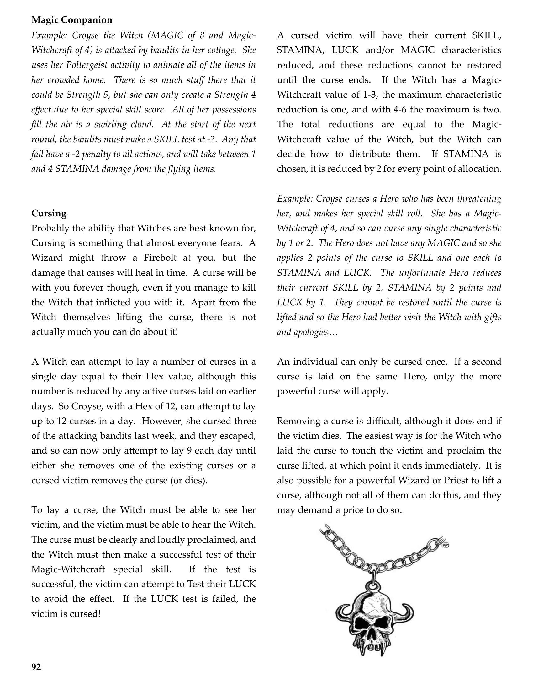
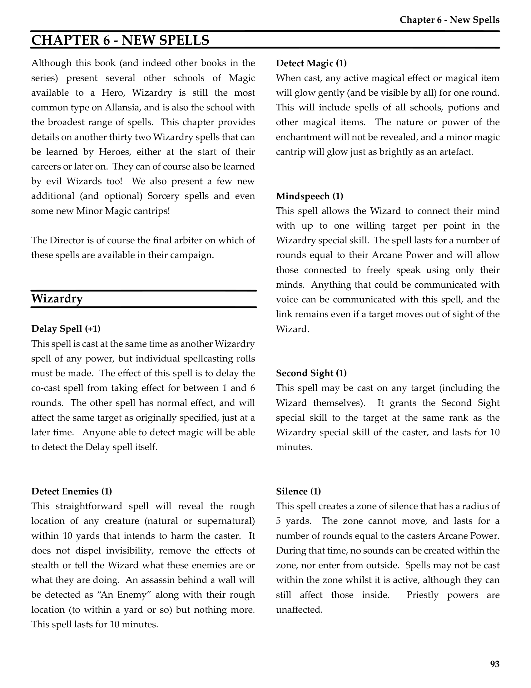
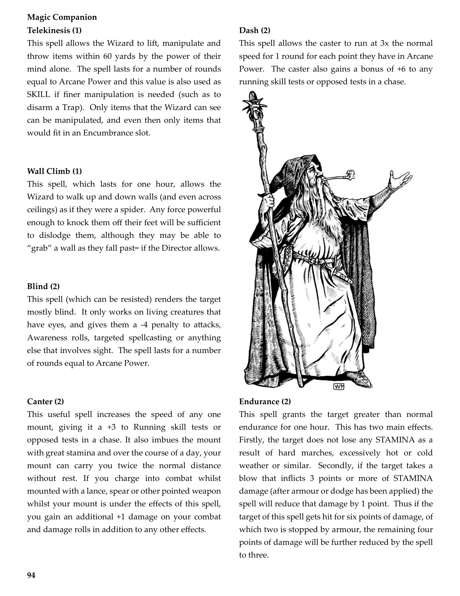
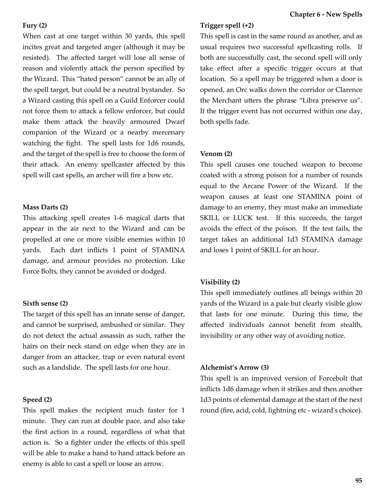
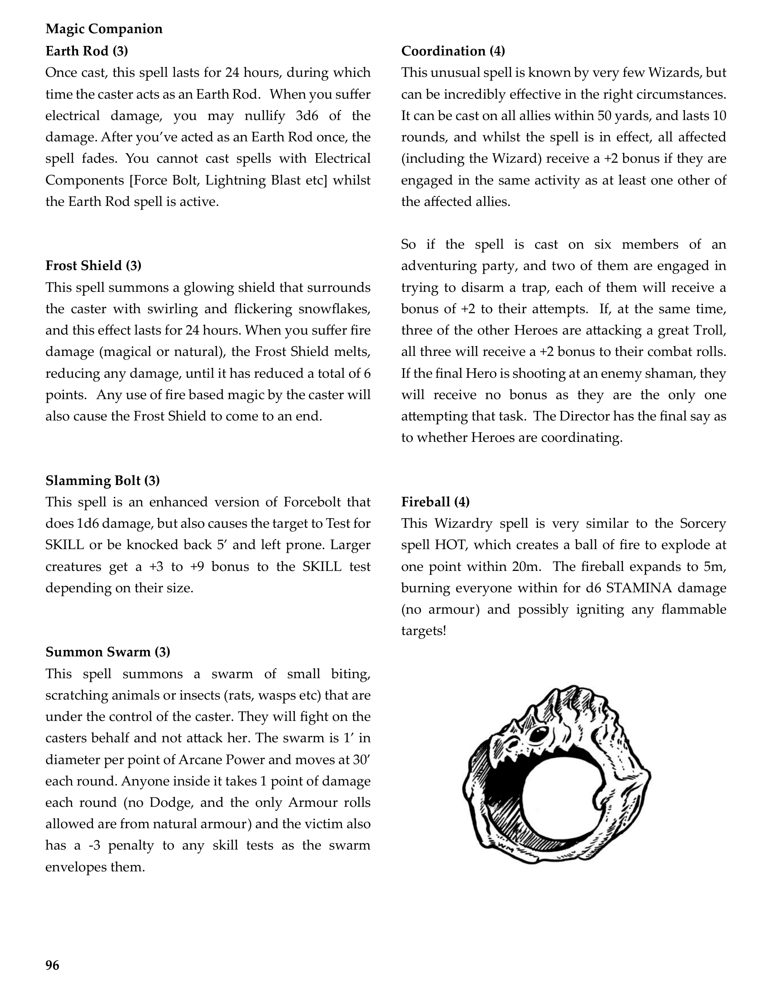
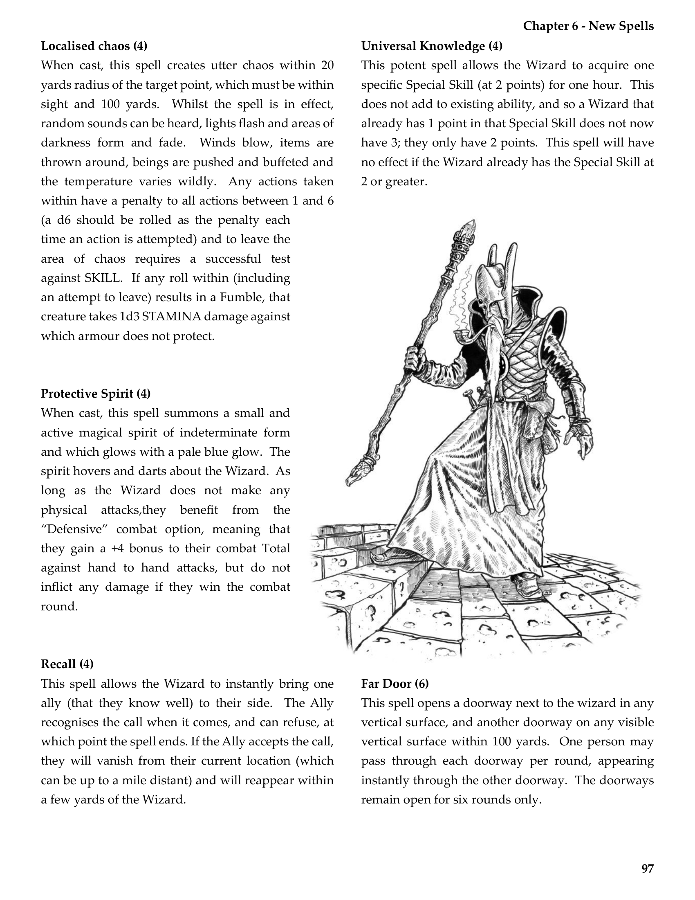
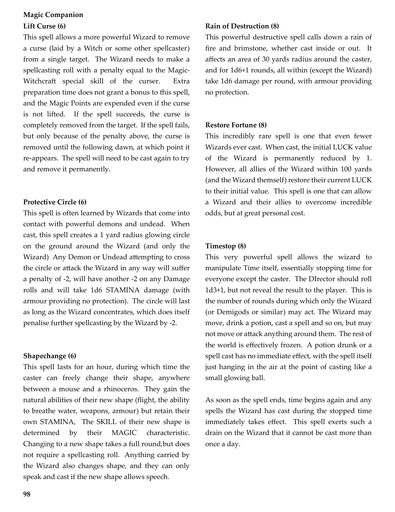
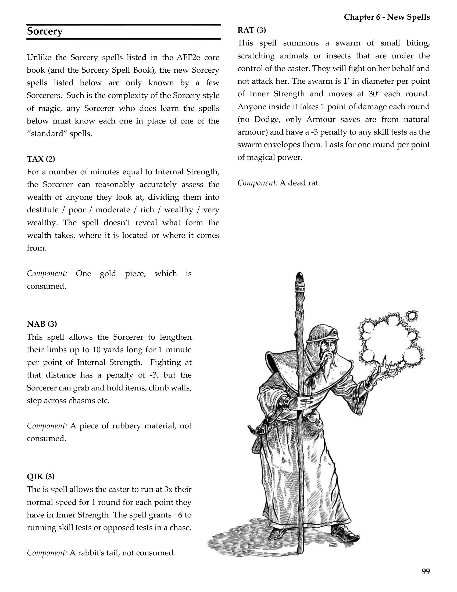
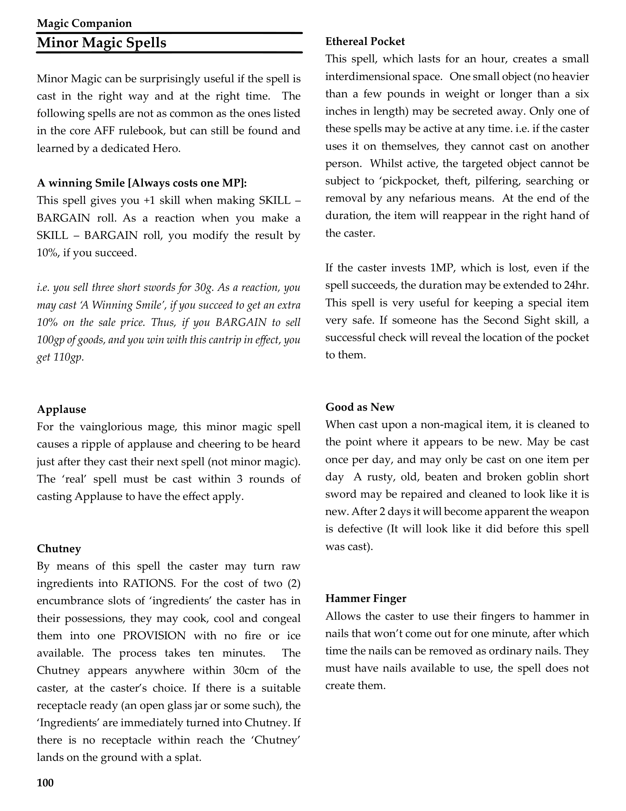
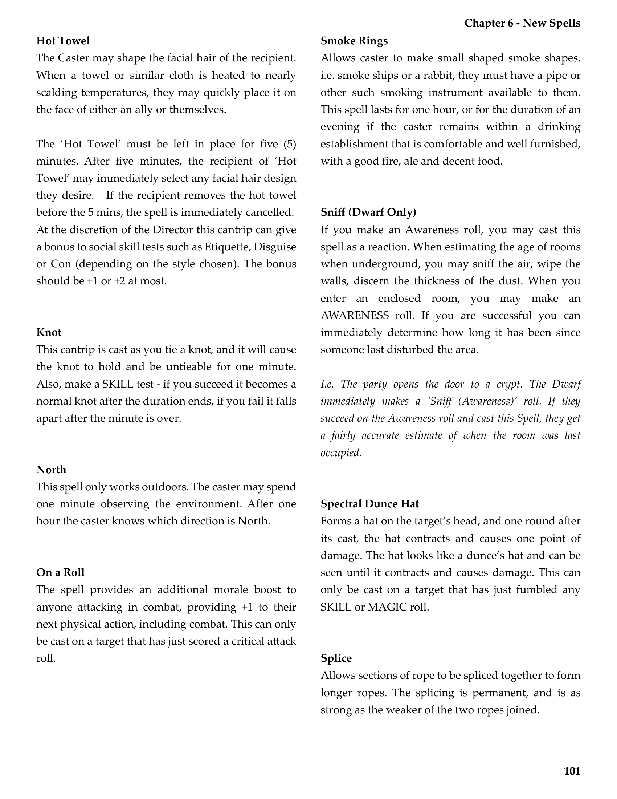

# New Spells

**Source:** CB77028 - Magic Companion  
**Pages:** 93-102

Chapter 6: New Spells

---

## Chapter 6 - New Spells

Although this book (and indeed other books in the series) present several other schools of Magic available to a Hero, Wizardry is still the most common type on Allansia, and is also the school with the broadest range of spells. This chapter provides details on another thirty two Wizardry spells that can be learned by Heroes, either at the start of their careers or later on. They can of course also be learned by evil Wizards too! We also present a few new additional (and optional) Sorcery spells and even some new Minor Magic cantrips!

The Director is of course the final arbiter on which of these spells are available in their campaign.

---

## Wizardry Spells

### Delay Spell (+1)

This spell is cast at the same time as another Wizardry spell of any power, but individual spellcasting rolls must be made. The effect of this spell is to delay the co-cast spell from taking effect for between 1 and 6 rounds. The other spell has normal effect, and will affect the same target as originally specified, just at a later time. Anyone able to detect magic will be able to detect the Delay spell itself.

### Detect Magic (1)

When cast, any active magical effect or magical item will glow gently (and be visible by all) for one round. This will include spells of all schools, potions and other magical items. The nature or power of the enchantment will not be revealed, and a minor magic cantrip will glow just as brightly as an artefact.

### Mindspeech (1)

This spell allows the Wizard to connect their mind with up to one willing target per point in the Wizardry special skill. The spell lasts for a number of rounds equal to their Arcane Power and will allow those connected to freely speak using only their minds. Anything that could be communicated with voice can be communicated with this spell, and the link remains even if a target moves out of sight of the Wizard.

### Second Sight (1)

This spell may be cast on any target (including the Wizard themselves). It grants the Second Sight special skill to the target at the same rank as the Wizardry special skill of the caster, and lasts for 10 minutes.

### Detect Enemies (1)

This straightforward spell will reveal the rough location of any creature (natural or supernatural) within 10 yards that intends to harm the caster. It does not dispel invisibility, remove the effects of stealth or tell the Wizard what these enemies are or what they are doing. An assassin behind a wall will be detected as "An Enemy" along with their rough location (to within a yard or so) but nothing more. This spell lasts for 10 minutes.

### Silence (1)

This spell creates a zone of silence that has a radius of 5 yards. The zone cannot move, and lasts for a number of rounds equal to the casters Arcane Power. During that time, no sounds can be created within the zone, nor enter from outside. Spells may not be cast within the zone whilst it is active, although they can still affect those inside. Priestly powers are unaffected.

### Telekinesis (1)

This spell allows the Wizard to lift, manipulate and throw items within 60 yards by the power of their mind alone. The spell lasts for a number of rounds equal to Arcane Power and this value is also used as SKILL if finer manipulation is needed (such as to disarm a Trap). Only items that the Wizard can see can be manipulated, and even then only items that would fit in an Encumbrance slot.

### Wall Climb (1)

This spell, which lasts for one hour, allows the Wizard to walk up and down walls (and even across ceilings) as if they were a spider. Any force powerful enough to knock them off their feet will be sufficient to dislodge them, although they may be able to "grab" a wall as they fall past if the Director allows.

### Blind (2)

This spell (which can be resisted) renders the target mostly blind. It only works on living creatures that have eyes, and gives them a -4 penalty to attacks, Awareness rolls, targeted spellcasting or anything else that involves sight. The spell lasts for a number of rounds equal to Arcane Power.

### Canter (2)

This useful spell increases the speed of any one mount, giving it a +3 to Running skill tests or opposed tests in a chase. It also imbues the mount with great stamina and over the course of a day, your mount can carry you twice the normal distance without rest. If you charge into combat whilst mounted with a lance, spear or other pointed weapon whilst your mount is under the effects of this spell, you gain an additional +1 damage on your combat and damage rolls in addition to any other effects.

### Endurance (2)

This spell grants the target greater than normal endurance for one hour. This has two main effects. Firstly, the target does not lose any STAMINA as a result of hard marches, excessively hot or cold weather or similar. Secondly, if the target takes a blow that inflicts 3 points or more of STAMINA damage (after armour or dodge has been applied) the spell will reduce that damage by 1 point. Thus if the target of this spell gets hit for six points of damage, of which two is stopped by armour, the remaining four points of damage will be further reduced by the spell to three.

### Fury (2)

When cast at one target within 30 yards, this spell incites great and targeted anger (although it may be resisted). The affected target will lose all sense of reason and violently attack the person specified by the Wizard. This "hated person" cannot be an ally of the spell target, but could be a neutral bystander. So a Wizard casting this spell on a Guild Enforcer could not force them to attack a fellow enforcer, but could make them attack the heavily armoured Dwarf companion of the Wizard or a nearby mercenary watching the fight. The spell lasts for 1d6 rounds, and the target of the spell is free to choose the form of their attack. An enemy spellcaster affected by this spell will cast spells, an archer will fire a bow etc.

### Mass Darts (2)

This attacking spell creates 1-6 magical darts that appear in the air next to the Wizard and can be propelled at one or more visible enemies within 10 yards. Each dart inflicts 1 point of STAMINA damage, and armour provides no protection. Like Force Bolts, they cannot be avoided or dodged.

### Sixth Sense (2)

The target of this spell has an innate sense of danger, and cannot be surprised, ambushed or similar. They do not detect the actual assassin as such, rather the hairs on their neck stand on edge when they are in danger from an attacker, trap or even natural event such as a landslide. The spell lasts for one hour.

### Speed (2)

This spell makes the recipient much faster for 1 minute. They can run at double pace, and also take the first action in a round, regardless of what that action is. So a fighter under the effects of this spell will be able to make a hand to hand attack before an enemy is able to cast a spell or loose an arrow.

### Trigger Spell (+2)

This spell is cast in the same round as another, and as usual requires two successful spellcasting rolls. If both are successfully cast, the second spell will only take effect after a specific trigger occurs at that location. So a spell may be triggered when a door is opened, an Orc walks down the corridor or Clarence the Merchant utters the phrase "Libra preserve us". If the trigger event has not occurred within one day, both spells fade.

### Venom (2)

This spell causes one touched weapon to become coated with a strong poison for a number of rounds equal to the Arcane Power of the Wizard. If the weapon causes at least one STAMINA point of damage to an enemy, they must make an immediate SKILL or LUCK test. If this succeeds, the target avoids the effect of the poison. If the test fails, the target takes an additional 1d3 STAMINA damage and loses 1 point of SKILL for an hour.

### Visibility (2)

This spell immediately outlines all beings within 20 yards of the Wizard in a pale but clearly visible glow that lasts for one minute. During this time, the affected individuals cannot benefit from stealth, invisibility or any other way of avoiding notice.

### Alchemist's Arrow (3)

This spell is an improved version of Forcebolt that inflicts 1d6 damage when it strikes and then another 1d3 points of elemental damage at the start of the next round (fire, acid, cold, lightning etc - wizard's choice).

### Dash (2)

This spell allows the caster to run at 3x the normal speed for 1 round for each point they have in Arcane Power. The caster also gains a bonus of +6 to any running skill tests or opposed tests in a chase.

### Earth Rod (3)

Once cast, this spell lasts for 24 hours, during which time the caster acts as an Earth Rod. When you suffer electrical damage, you may nullify 3d6 of the damage. After you've acted as an Earth Rod once, the spell fades. You cannot cast spells with Electrical Components [Force Bolt, Lightning Blast etc] whilst the Earth Rod spell is active.

### Frost Shield (3)

This spell summons a glowing shield that surrounds the caster with swirling and flickering snowflakes, and this effect lasts for 24 hours. When you suffer fire damage (magical or natural), the Frost Shield melts, reducing any damage, until it has reduced a total of 6 points. Any use of fire based magic by the caster will also cause the Frost Shield to come to an end.

### Slamming Bolt (3)

This spell is an enhanced version of Forcebolt that does 1d6 damage, but also causes the target to Test for SKILL or be knocked back 5' and left prone. Larger creatures get a +3 to +9 bonus to the SKILL test depending on their size.

### Summon Swarm (3)

This spell summons a swarm of small biting, scratching animals or insects (rats, wasps etc) that are under the control of the caster. They will fight on the casters behalf and not attack her. The swarm is 1' in diameter per point of Arcane Power and moves at 30' each round. Anyone inside it takes 1 point of damage each round (no Dodge, and the only Armour rolls allowed are from natural armour) and the victim also has a -3 penalty to any skill tests as the swarm envelopes them.

### Coordination (4)

This unusual spell is known by very few Wizards, but can be incredibly effective in the right circumstances. It can be cast on all allies within 50 yards, and lasts 10 rounds, and whilst the spell is in effect, all affected (including the Wizard) receive a +2 bonus if they are engaged in the same activity as at least one other of the affected allies.

So if the spell is cast on six members of an adventuring party, and two of them are engaged in trying to disarm a trap, each of them will receive a bonus of +2 to their attempts. If, at the same time, three of the other Heroes are attacking a great Troll, all three will receive a +2 bonus to their combat rolls. If the final Hero is shooting at an enemy shaman, they will receive no bonus as they are the only one attempting that task. The Director has the final say as to whether Heroes are coordinating.

### Fireball (4)

This Wizardry spell is very similar to the Sorcery spell HOT, which creates a ball of fire to explode at one point within 20m. The fireball expands to 5m, burning everyone within for d6 STAMINA damage (no armour) and possibly igniting any flammable targets!

### Localised Chaos (4)

When cast, this spell creates utter chaos within 20 yards radius of the target point, which must be within sight and 100 yards. Whilst the spell is in effect, random sounds can be heard, lights flash and areas of darkness form and fade. Winds blow, items are thrown around, beings are pushed and buffeted and the temperature varies wildly. Any actions taken within have a penalty to all actions between 1 and 6 (a d6 should be rolled as the penalty each time an action is attempted) and to leave the area of chaos requires a successful test against SKILL. If any roll within (including an attempt to leave) results in a Fumble, that creature takes 1d3 STAMINA damage against which armour does not protect.

### Protective Spirit (4)

When cast, this spell summons a small and active magical spirit of indeterminate form and which glows with a pale blue glow. The spirit hovers and darts about the Wizard. As long as the Wizard does not make any physical attacks, they benefit from the "Defensive" combat option, meaning that they gain a +4 bonus to their combat Total against hand to hand attacks, but do not inflict any damage if they win the combat round.

### Recall (4)

This spell allows the Wizard to instantly bring one ally (that they know well) to their side. The Ally recognises the call when it comes, and can refuse, at which point the spell ends. If the Ally accepts the call, they will vanish from their current location (which can be up to a mile distant) and will reappear within a few yards of the Wizard.

### Universal Knowledge (4)

This potent spell allows the Wizard to acquire one specific Special Skill (at 2 points) for one hour. This does not add to existing ability, and so a Wizard that already has 1 point in that Special Skill does not now have 3; they only have 2 points. This spell will have no effect if the Wizard already has the Special Skill at 2 or greater.

### Far Door (6)

This spell opens a doorway next to the wizard in any vertical surface, and another doorway on any visible vertical surface within 100 yards. One person may pass through each doorway per round, appearing instantly through the other doorway. The doorways remain open for six rounds only.

### Lift Curse (6)

This spell allows a more powerful Wizard to remove a curse (laid by a Witch or some other spellcaster) from a single target. The Wizard needs to make a spellcasting roll with a penalty equal to the Magic-Witchcraft special skill of the curser. Extra preparation time does not grant a bonus to this spell, and the Magic Points are expended even if the curse is not lifted. If the spell succeeds, the curse is completely removed from the target. If the spell fails, but only because of the penalty above, the curse is removed until the following dawn, at which point it re-appears. The spell will need to be cast again to try and remove it permanently.

### Protective Circle (6)

This spell is often learned by Wizards that come into contact with powerful demons and undead. When cast, this spell creates a 1 yard radius glowing circle on the ground around the Wizard (and only the Wizard) Any Demon or Undead attempting to cross the circle or attack the Wizard in any way will suffer a penalty of -2, will have another -2 on any Damage rolls and will take 1d6 STAMINA damage (with armour providing no protection). The circle will last as long as the Wizard concentrates, which does penalise further spellcasting by the Wizard by -2.

### Shapechange (6)

This spell lasts for an hour, during which time the caster can freely change their shape, anywhere between a mouse and a rhinoceros. They gain the natural abilities of their new shape (flight, the ability to breathe water, weapons, armour) but retain their own STAMINA, The SKILL of their new shape is determined by their MAGIC characteristic. Changing to a new shape takes a full round, but does not require a spellcasting roll. Anything carried by the Wizard also changes shape, and they can only speak and cast if the new shape allows speech.

### Rain of Destruction (8)

This powerful destructive spell calls down a rain of fire and brimstone, whether cast inside or out. It affects an area of 30 yards radius around the caster, and for 1d6+1 rounds, all within (except the Wizard) take 1d6 damage per round, with armour providing no protection.

### Restore Fortune (8)

This incredibly rare spell is one that even fewer Wizards ever cast. When cast, the initial LUCK value of the Wizard is permanently reduced by 1. However, all allies of the Wizard within 100 yards (and the Wizard themself) restore their current LUCK to their initial value. This spell is one that can allow a Wizard and their allies to overcome incredible odds, but at great personal cost.

### Timestop (8)

This very powerful spell allows the wizard to manipulate Time itself, essentially stopping time for everyone except the caster. The Director should roll 1d3+1, but not reveal the result to the player. This is the number of rounds during which only the Wizard itself (or Demigods or similar) may act. The Wizard may move, drink a potion, cast a spell and so on, but may not move or attack anything around them. The rest of the world is effectively frozen. A potion drunk or a spell cast has no immediate effect, with the spell itself just hanging in the air at the point of casting like a small glowing ball.

As soon as the spell ends, time begins again and any spells the Wizard has cast during the stopped time immediately takes effect. This spell exerts such a drain on the Wizard that it cannot be cast more than once a day.

---

## Sorcery Spells

Unlike the Sorcery spells listed in the AFF2e core book (and the Sorcery Spell Book), the new Sorcery spells listed below are only known by a few Sorcerers. Such is the complexity of the Sorcery style of magic, any Sorcerer who does learn the spells below must know each one in place of one of the "standard" spells.

### TAX (2)

For a number of minutes equal to Internal Strength, the Sorcerer can reasonably accurately assess the wealth of anyone they look at, dividing them into destitute / poor / moderate / rich / wealthy / very wealthy. The spell doesn't reveal what form the wealth takes, where it is located or where it comes from.

**Component:** One gold piece, which is consumed.

### NAB (3)

This spell allows the Sorcerer to lengthen their limbs up to 10 yards long for 1 minute per point of Internal Strength. Fighting at that distance has a penalty of -3, but the Sorcerer can grab and hold items, climb walls, step across chasms etc.

**Component:** A piece of rubbery material, not consumed.

### QIK (3)

This spell allows the caster to run at 3x their normal speed for 1 round for each point they have in Inner Strength. The spell grants +6 to running skill tests or opposed tests in a chase.

**Component:** A rabbit's tail, not consumed.

### RAT (3)

This spell summons a swarm of small biting, scratching animals or insects that are under the control of the caster. They will fight on her behalf and not attack her. The swarm is 1' in diameter per point of Inner Strength and moves at 30' each round. Anyone inside it takes 1 point of damage each round (no Dodge, only Armour saves are from natural armour) and have a -3 penalty to any skill tests as the swarm envelopes them. Lasts for one round per point of magical power.

**Component:** A dead rat.

---

## Minor Magic Spells

Minor Magic can be surprisingly useful if the spell is cast in the right way and at the right time. The following spells are not as common as the ones listed in the core AFF rulebook, but can still be found and learned by a dedicated Hero.

### A Winning Smile [Always costs one MP]

This spell gives you +1 skill when making SKILL – BARGAIN roll. As a reaction when you make a SKILL – BARGAIN roll, you modify the result by 10%, if you succeed.

i.e. you sell three short swords for 30g. As a reaction, you may cast 'A Winning Smile', if you succeed to get an extra 10% on the sale price. Thus, if you BARGAIN to sell 100gp of goods, and you win with this cantrip in effect, you get 110gp.

### Applause

For the vainglorious mage, this minor magic spell causes a ripple of applause and cheering to be heard just after they cast their next spell (not minor magic). The 'real' spell must be cast within 3 rounds of casting Applause to have the effect apply.

### Chutney

By means of this spell the caster may turn raw ingredients into RATIONS. For the cost of two (2) encumbrance slots of 'ingredients' the caster has in their possessions, they may cook, cool and congeal them into one PROVISION with no fire or ice available. The process takes ten minutes. The Chutney appears anywhere within 30cm of the caster, at the caster's choice. If there is a suitable receptacle ready (an open glass jar or some such), the 'Ingredients' are immediately turned into Chutney. If there is no receptacle within reach the 'Chutney' lands on the ground with a splat.

### Ethereal Pocket

This spell, which lasts for an hour, creates a small interdimensional space. One small object (no heavier than a few pounds in weight or longer than a six inches in length) may be secreted away. Only one of these spells may be active at any time. i.e. if the caster uses it on themselves, they cannot cast on another person. Whilst active, the targeted object cannot be subject to 'pickpocket, theft, pilfering, searching or removal by any nefarious means. At the end of the duration, the item will reappear in the right hand of the caster.

If the caster invests 1MP, which is lost, even if the spell succeeds, the duration may be extended to 24hr. This spell is very useful for keeping a special item very safe. If someone has the Second Sight skill, a successful check will reveal the location of the pocket to them.

### Good as New

When cast upon a non-magical item, it is cleaned to the point where it appears to be new. May be cast once per day, and may only be cast on one item per day. A rusty, old, beaten and broken goblin short sword may be repaired and cleaned to look like it is new. After 2 days it will become apparent the weapon is defective (It will look like it did before this spell was cast).

### Hammer Finger

Allows the caster to use their fingers to hammer in nails that won't come out for one minute, after which the nails can be removed as ordinary nails. They must have nails available to use, the spell does not create them.

### Hot Towel

The Caster may shape the facial hair of the recipient. When a towel or similar cloth is heated to nearly scalding temperatures, they may quickly place it on the face of either an ally or themselves.

The 'Hot Towel' must be left in place for five (5) minutes. After five minutes, the recipient of 'Hot Towel' may immediately select any facial hair design they desire. If the recipient removes the hot towel before the 5 mins, the spell is immediately cancelled. At the discretion of the Director this cantrip can give a bonus to social skill tests such as Etiquette, Disguise or Con (depending on the style chosen). The bonus should be +1 or +2 at most.

### Knot

This cantrip is cast as you tie a knot, and it will cause the knot to hold and be untieable for one minute. Also, make a SKILL test - if you succeed it becomes a normal knot after the duration ends, if you fail it falls apart after the minute is over.

### North

This spell only works outdoors. The caster may spend one minute observing the environment. After one hour the caster knows which direction is North.

### On a Roll

The spell provides an additional morale boost to anyone attacking in combat, providing +1 to their next physical action, including combat. This can only be cast on a target that has just scored a critical attack roll.

### Smoke Rings

Allows caster to make small shaped smoke shapes. i.e. smoke ships or a rabbit, they must have a pipe or other such smoking instrument available to them. This spell lasts for one hour, or for the duration of an evening if the caster remains within a drinking establishment that is comfortable and well furnished, with a good fire, ale and decent food.

### Sniff (Dwarf Only)

If you make an Awareness roll, you may cast this spell as a reaction. When estimating the age of rooms when underground, you may sniff the air, wipe the walls, discern the thickness of the dust. When you enter an enclosed room, you may make an AWARENESS roll. If you are successful you can immediately determine how long it has been since someone last disturbed the area.

I.e. The party opens the door to a crypt. The Dwarf immediately makes a 'Sniff (Awareness)' roll. If they succeed on the Awareness roll and cast this Spell, they get a fairly accurate estimate of when the room was last occupied.

### Spectral Dunce Hat

Forms a hat on the target's head, and one round after its cast, the hat contracts and causes one point of damage. The hat looks like a dunce's hat and can be seen until it contracts and causes damage. This can only be cast on a target that has just fumbled any SKILL or MAGIC roll.

### Splice

Allows sections of rope to be spliced together to form longer ropes. The splicing is permanent, and is as strong as the weaker of the two ropes joined.

---

## Page Images

