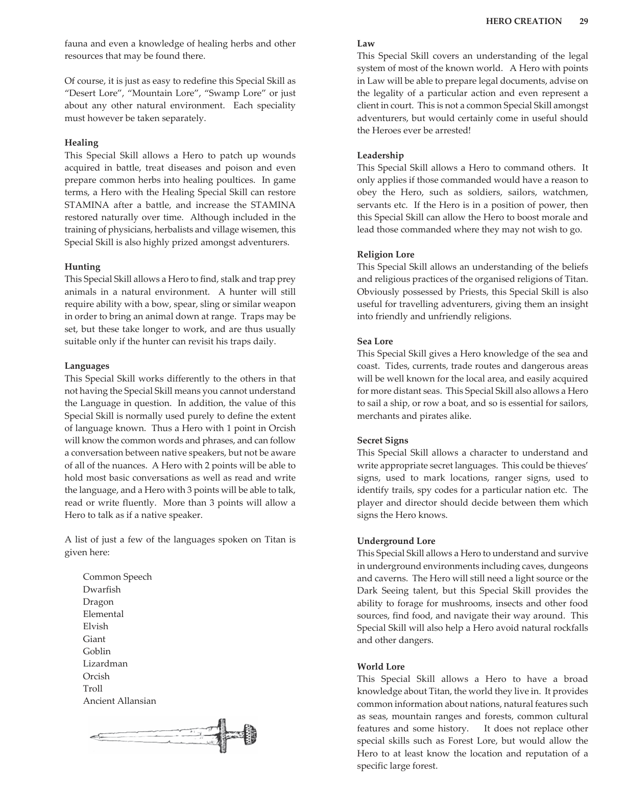

# Crafting

**Characteristic:** Knowledge

**Tech Levels:** Basic, Low, Medium, High

Knowledge Skills cover specific areas of lore or craft, allowing a Character to know or do something related to that knowledge. These skills may add to either PHYSICAL, MENTAL, or SOCIAL (whichever is higher), depending on the specific application.

This skill requires a specific craft to be chosen, allowing the Character to design, create, and repair items related to that craft, and also to determine an item's worth. Examples include blacksmithing, carpentry, leatherworking, or any other craft profession.

## Source

**AFF - Advanced Fighting Fantasy 2nd Ed, Page 0028**

**AFF - Advanced Fighting Fantasy 2nd Ed, Page 0029**

