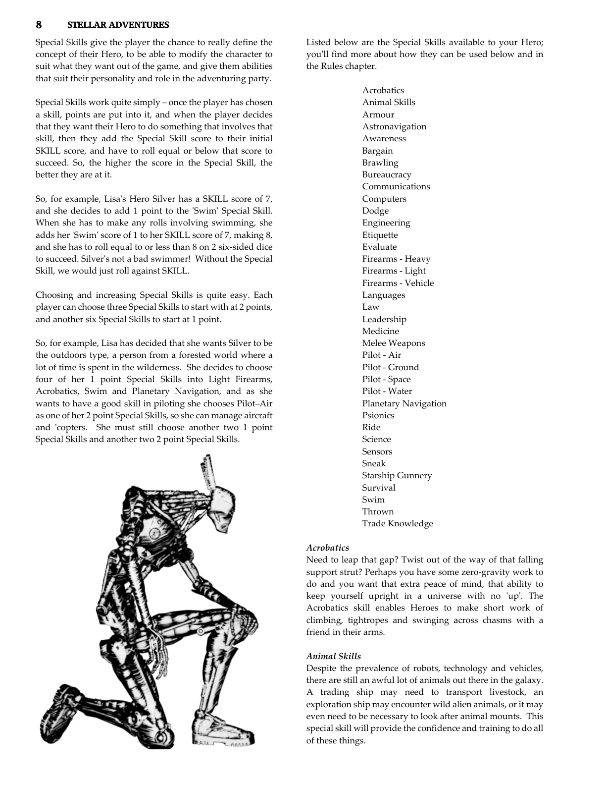

# Animal Skills

**Characteristic:** MENTAL

**Tech Levels:** Basic, Low, Medium, High

Despite the advanced technology of the galaxy, there are still times when a Hero will need to transport livestock, encounter wild alien animals, or look after animal mounts. This special skill provides the confidence and training to do all of these things.

## Source

**CB77011 - Stellar Adventures, Page 0009**

---

**AFF - Advanced Fighting Fantasy 2nd Ed, Page 0028**

---

**AFF - Advanced Fighting Fantasy 2nd Ed, Page 0029**

