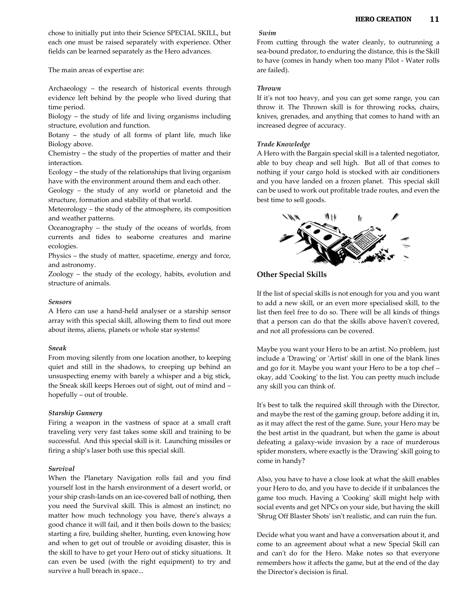

# Sensors

**Characteristic:** MENTAL

**Tech Levels:** Medium, High

A special skill allowing a Hero to use a hand-held analyser or starship sensor array. Purpose: To find out more about items, aliens, planets, or entire star systems.

## Source

**CB77011 - Stellar Adventures, Page 0012**

