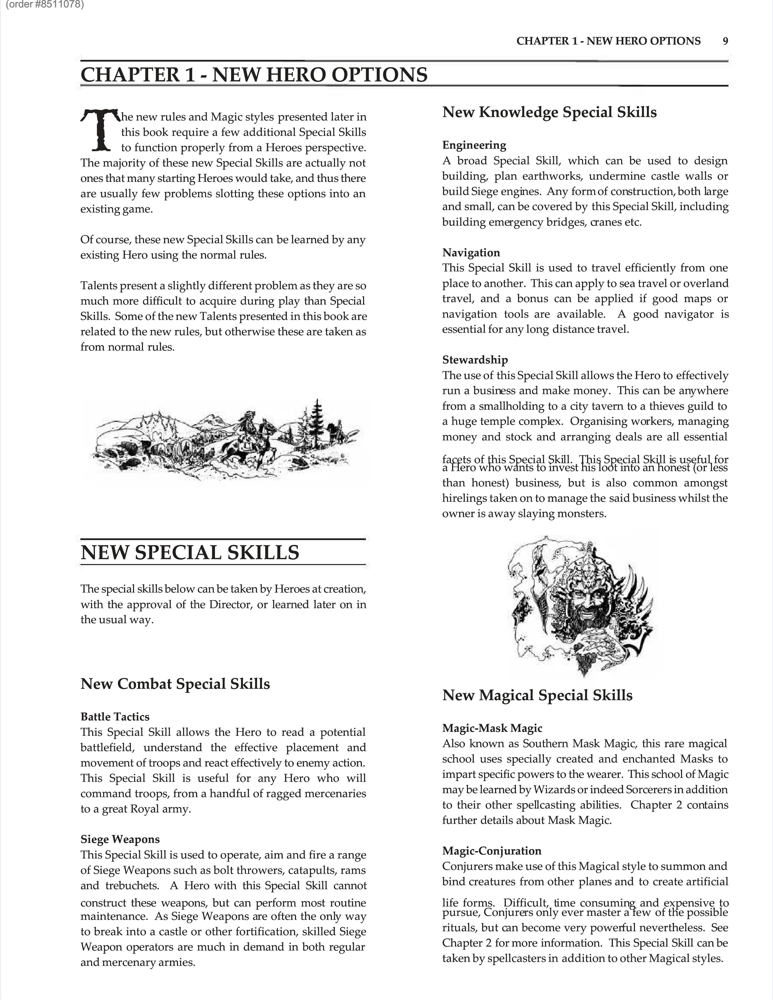

# Tactics

**Source:** Heroes Companion (Chapter 1)

**Category:** Combat Skill (PHYSICAL)

This Special Skill allows a Hero to read a battlefield, understand troop placement and movement, and react to enemy actions. It's useful for commanding troops, from mercenaries to a royal army.

## Source

**AFF005 - Heroes Companion, Page 0010**

