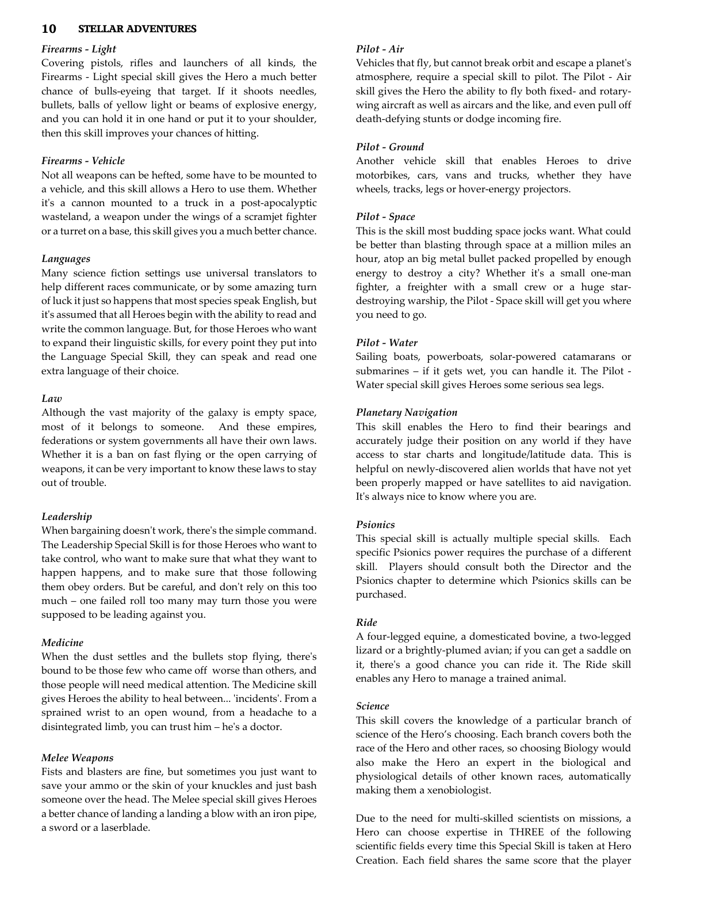
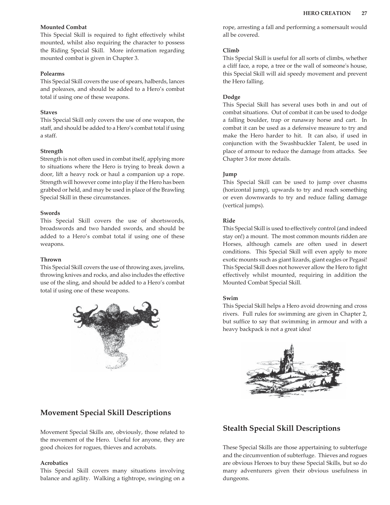

# Ride

**Characteristic:** PHYSICAL

**Tech Levels:** Basic, Low, Medium, High

A four-legged equine, a domesticated bovine, a two-legged lizard or a brightly-plumed avian; if you can get a saddle on it, there's a good chance you can ride it. The Ride skill enables any Hero to manage a trained animal.

## Source

**CB77011 - Stellar Adventures, Page 0011**

---

**AFF - Advanced Fighting Fantasy 2nd Ed, Page 0027**

---

**AFF - Advanced Fighting Fantasy 2nd Ed, Page 0028**

