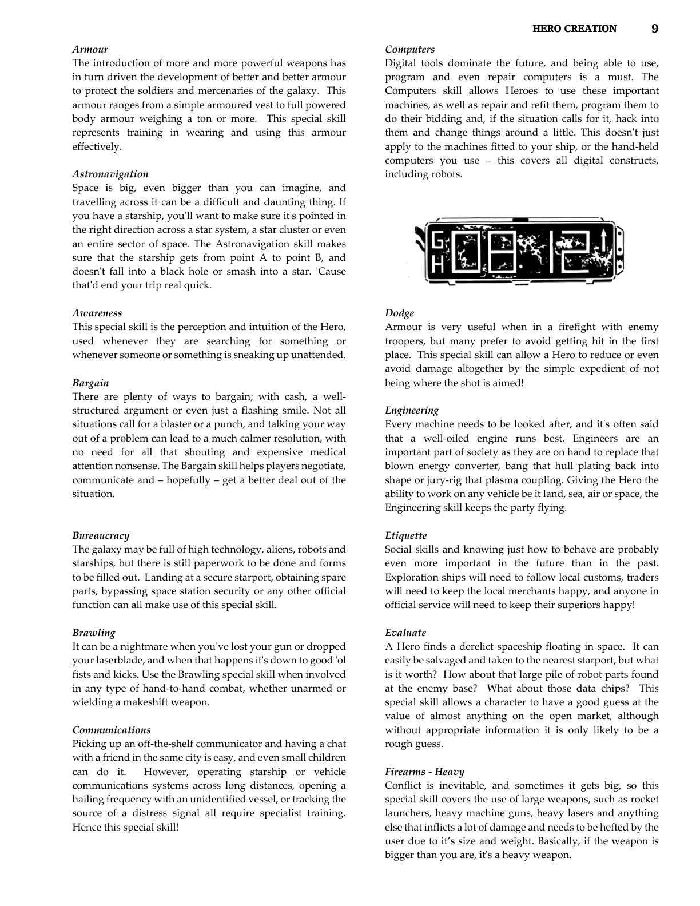

# Brawling

**Characteristic:** PHYSICAL

**Tech Levels:** Basic, Low, Medium, High

## Stellar Adventures (Page 9)

It can be a nightmare when you've lost your gun or dropped your laserblade, and when that happens it's down to good 'ol fists and kicks. Use the Brawling special skill when involved in any type of hand-to-hand combat, whether unarmed or wielding a makeshift weapon.

## Advanced Fighting Fantasy 2nd Ed (Page 26)

This Special Skill applies if a Hero is fighting with his fists, feet or head, with any sort of improvised weapon such as a chair or bottle, and even with small weapons such as daggers and knives. This Special Skill also governs the use of grappling and wrestling.

## Source

**CB77011 - Stellar Adventures, Page 9**

---

**AFF - Advanced Fighting Fantasy 2nd Ed, Page 26**

